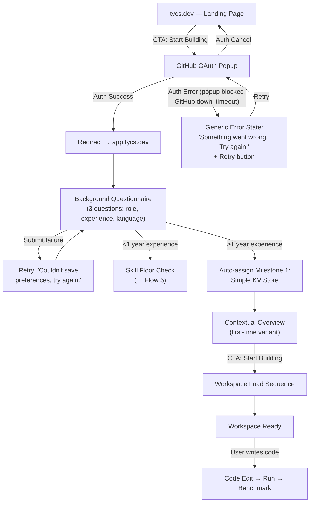
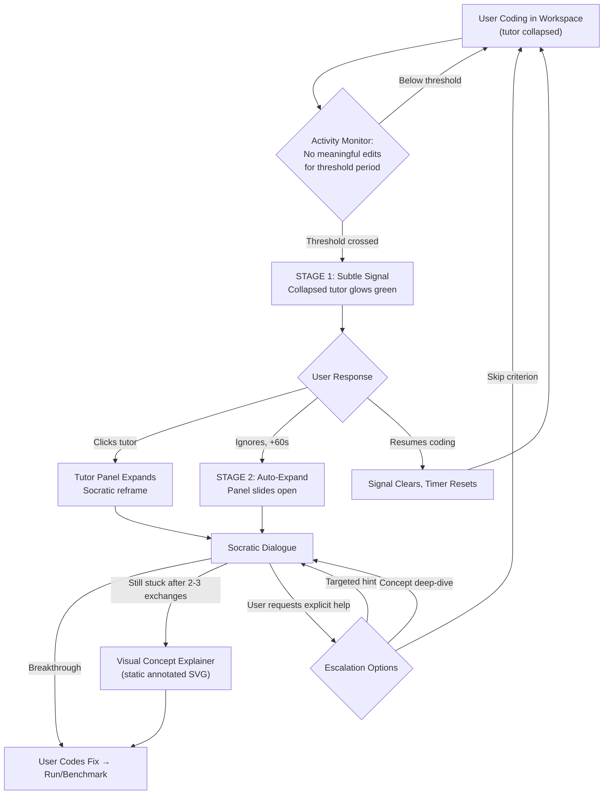
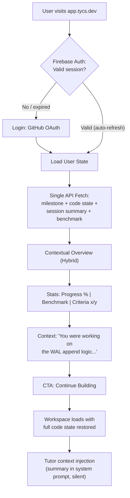
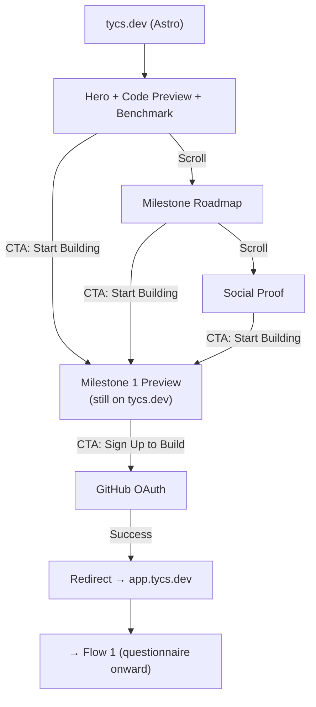
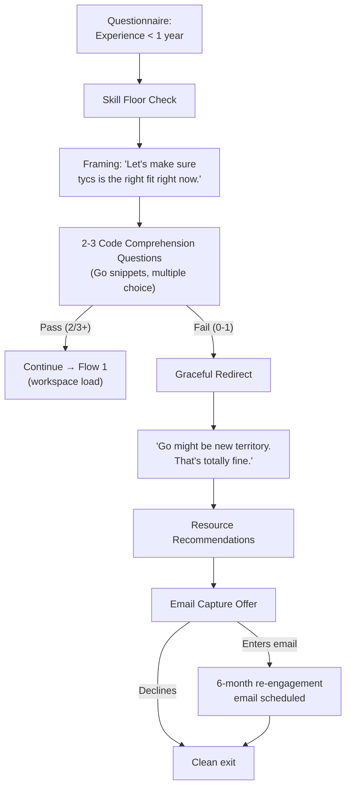
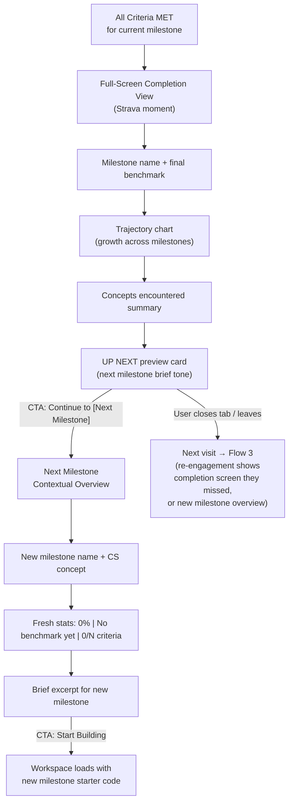

# UX Design Specification tycs

**Author:** Ducdo
**Date:** 2026-02-24

---

## Executive Summary

### Project Vision

tycs is a CS foundations learning platform where working software engineers build a real database from scratch — progressing through 5 milestones from a simple key-value store to ACID transactions. The "invisible curriculum" philosophy means CS concepts are encountered because the build demands them, not because a syllabus dictates it. The product competes on depth and authenticity against textbooks (passive), MOOCs (low completion), CodeCrafters (no teaching), and Boot.dev (shallow gamification).

The UX must serve a singular purpose: keep an engineer building after a full workday, evening after evening, milestone after milestone. Every design decision flows from this constraint — limited cognitive bandwidth, high intrinsic motivation, zero tolerance for friction.

### Target Users

**Primary personas** share a common profile: working software engineers (1-5+ years), building on laptops, evenings and weekends, with limited energy after professional coding. Three archetypes capture the motivation spectrum:

- **Marcus (Knowledge Seeker)** — Backend engineer, 3 years. Genuinely curious, has failed with textbooks twice. Needs depth that fits into 30-60 minute evening sessions. Success signal: posts benchmark screenshots to team Slack.
- **Priya (Career Upgrader)** — Frontend developer, 5 years. Blocked at Staff level, needs demonstrable systems thinking. Pragmatic and career-driven. Success signal: contributes to architecture discussions at work from experience, not textbooks.
- **Jake (Eager Leveler)** — Junior full-stack dev, 1.5 years. Bootcamp grad, proactive but easily overwhelmed. Needs guardrails and progressive confidence building. Success signal: survives the Milestone 3 B-tree wall without abandoning.

**Tech-savviness:** High — these are professional developers. They expect a quality code editor, fast compilation, and no hand-holding on tooling. But they are not power users of learning platforms — they have scar tissue from abandoned textbooks and courses.

**Device context:** Desktop/laptop primary. Mobile is read-only (check progress, read tutor messages). No tablet optimization needed for MVP.

### Key Design Challenges

1. **The first 15 minutes are everything** — Time to first "Aha!" must be under 30 minutes, but the real target is visceral success in the first 5. Marcus sees "1,000 key-value pairs written to disk" and his skepticism breaks. If onboarding doesn't deliver that emotional shift from "I can't build a database" to "wait, I just DID that," nothing else matters. The onboarding flow — signup, questionnaire, skill check, first milestone — must be ruthlessly frictionless with zero decision points.

2. **Workspace information density and temporal loading** — The milestone workspace (code editor + AI tutor panel + benchmark output + milestone brief) is a complex multi-panel interface that must feel simple at 11pm. But it's also a *temporal* challenge: Monaco editor lazy-loads (~1.5s), benchmark round-trips take up to 10s, AI tutor streams token-by-token. These panels don't arrive simultaneously. The workspace must feel alive and progressively loaded, not frozen while waiting. Loading states need to be graceful, not jarring.

3. **The stuck moment as a UX event** — When a learner hits a wall (especially the Milestone 3 B-tree cliff), the product has 7-10 minutes before tab-close. AI tutor intervention must feel like a supportive colleague leaning over, not a system alert. Timing, tone, visual placement, and escalation paths (reframe, skip-with-bookmark, lateral detour) are critical. Visual concept explainers (static annotated SVGs) need to surface naturally within the flow.

4. **Re-engagement without guilt** — Returning users (days to months absent) need zero-friction re-entry. The session summary and "Continue Building" flow must feel effortless and welcoming without acknowledging the absence. Pre-computed summaries injected into the AI tutor context enable the product to say "here's where you were" without making the user feel bad about leaving.

5. **Two front doors with a blurred boundary** — The Astro landing page (convert skeptics with concrete proof) and the React webapp (get builders building) are separate deployments on separate subdomains (`tycs.dev` vs `app.tycs.dev`). The transition must feel invisible — no loading flash, no "different app" feeling. Complicating this: FR47 requires the landing page to preview real Milestone 1 content (editor, acceptance criteria, benchmarks), partially showing the product itself. The landing page is marketing AND product demo simultaneously.

6. **Skill floor redirect as emotional design** — Taylor's journey (wrong-fit user, <1 year experience) requires a graceful redirect that feels like respect, not rejection. The tone of "Go learn fundamentals first, come back when ready" must protect NPS while being genuinely helpful. This is a UX writing and emotional design challenge, not just product logic.

7. **Intentional mobile constraints** — Mobile read-only mode must feel designed, not broken. Engineers understand code editing on a phone is impractical — the mobile experience should lean into progress review and tutor conversation history.

### Design Opportunities

1. **Benchmark trajectory as emotional storytelling (Critical UX Investment)** — The performance visualization across milestones is the product's emotional core, primary sharing catalyst, and organic acquisition engine. "My database handles 25,000 inserts/sec" is the screenshot engineers post to Slack and Hacker News. No competitor offers this — CodeCrafters gives pass/fail, Boot.dev gives XP, Coursera gives percentages. tycs gives you a *performance number you own*. This deserves narrative-driven visual design: not a chart, but a story of a database growing up. This is a critical UX investment, not an optional enhancement.

2. **Scaffolding decay as visible capability growth** — The progressive reduction from 80% to 15% starter code can be visually communicated to reinforce learner confidence. Each milestone visually demonstrates "you needed less help this time." This mirrors the benchmark arc — internal evidence that the learner is growing.

3. **The "How the Pros Did It" reveal moment** — The diff view comparing your working implementation to SQLite/PostgreSQL is a peak emotional moment. Deliberate framing and timing can transform a code comparison into a visceral "I built something real" experience. This is the second-order skill no other platform teaches: how to read production code.

## Core User Experience

### Defining Experience

The core interaction loop is: **Edit code → Submit → See your database get better.** This atomic cycle is the product's heartbeat. Everything else — AI tutoring, scaffolding, comparisons, benchmarks — exists to support and enrich this loop. The loop has memory: each cycle contributes to a continuous trajectory. The database at Milestone 5 is the same database from Milestone 1, evolved through the learner's growing understanding.

The experience begins with a brief contextual overview on login — a motivation primer, not a dashboard. Four data points and one action: (1) current milestone + progress percentage, (2) last benchmark number with subtle trend indicator, (3) next acceptance criteria to tackle, and (4) "Continue Building" button. Nothing more. This overview does psychological work — Marcus sees "Milestone 3, 60% complete, 8,200 ops/sec" and his brain says "I'm close, I can push further tonight." Adding anything beyond these four elements (notifications, tips, announcements) breaks the zero-decision promise.

Sessions end quietly. The primary persistence mechanism is periodic auto-save (every 30-60 seconds), with best-effort exit save on tab close as a secondary layer. The `beforeunload` event is unreliable across browsers (Safari mobile fires it inconsistently, Chrome doesn't guarantee async request completion), so the product never depends on it. Users never think about saving — their work is always safe because it was saved 30 seconds ago, not because the tab-close event fired.

### Platform Strategy

- **Primary platform:** Desktop web application (React + Vite SPA) accessed via `app.tycs.dev`
- **Marketing/landing:** Astro static site at `tycs.dev` with real product content previews
- **Input method:** Mouse and keyboard primary — code editing is the core interaction
- **Connectivity:** Always-online required (server-side code execution, AI tutor API). Clear offline messaging.
- **Mobile strategy:** Read-only mode for progress review and AI tutor conversation history. No code editing on mobile — this is intentional, not a limitation.
- **Browser support:** Chrome, Firefox, Safari, Edge (latest 2 versions). No IE11/legacy.
- **Persistent connections:** AI tutor requires a background SSE connection per active session, even when the tutor panel is collapsed, to enable server-initiated stuck detection interventions. This is a persistent connection per session — architecturally significant at scale (100 concurrent = 100 open SSE connections).

### Effortless Interactions

- **Opening the app** — Contextual overview (4 data points + 1 action) → "Continue Building" → workspace. Zero navigation decisions, zero cognitive load. The overview is a motivation primer, not a dashboard.
- **Resuming after absence** — Pre-computed session summary surfaces where the user left off. The AI tutor receives this context automatically. No re-orientation, no guilt framing.
- **Getting help** — AI tutor panel is collapsed by default, appearing only when the user invokes it or when stuck detection triggers via the background SSE connection. It recedes when no longer needed. No mode-switching required.
- **Saving progress** — Entirely invisible. Periodic auto-save every 30-60 seconds as the primary mechanism, plus best-effort exit save on tab close. The user never thinks about saving because their work was checkpointed moments ago.
- **Advancing milestones** — Acceptance criteria are automatically evaluated on submission. Milestone completion is detected and celebrated. Advancement to the next milestone is a natural progression, not a menu selection.
- **Running benchmarks** — A deliberate checkpoint action, not automatic after every submission. Users run benchmarks when they're ready to see how their system performs, making the results feel earned. Benchmark-run frequency is tracked per milestone as an engagement signal — if users complete criteria but never voluntarily benchmark, the "emotional core" isn't landing.

### Critical Success Moments

| Moment | Experience | Stakes |
|---|---|---|
| **First 5 minutes** | User sees "1,000 key-value pairs written to disk" from code they wrote with 80% scaffolding | Emotional shift from "I can't build a database" to "I just did." Miss this window and the user never returns. Canary metric: time from signup completion to first successful code submission — if >10 minutes, onboarding is broken. |
| **First stuck moment** | AI tutor slides in quietly with a Socratic question via background SSE, not a popup or system alert | If intervention feels mechanical, the user closes the tab. If it feels like a supportive colleague, they push through. 7-10 minute window before abandonment. Requires instrumentation from day one: timestamp when user stops typing, timestamp when tutor triggers, timestamp when user resumes typing or closes tab. |
| **First benchmark run** | Deliberate user-initiated action produces real performance numbers for code they wrote | The visceral "I built something real" signal. This is the emotional hook that separates tycs from tutorials. |
| **Milestone completion** | All acceptance criteria met, benchmark trajectory visualization updates with new data point | The "my database just leveled up" moment. Must drive intrinsic motivation to start the next milestone (>70% return rate target). |
| **First "How the Pros Did It"** | Diff view shows user's implementation alongside SQLite/PostgreSQL | The "holy shit, I'm in the same ballpark as production code" revelation. Peak emotional moment. (Soft MVP) |
| **Return after absence** | "Continue Building" with pre-computed session summary, AI tutor context-aware of where the user left off | Zero guilt, zero friction. The product says "here's where you were" without acknowledging the gap. Miss this and returning users don't return again. |
| **Skill floor redirect** | Graceful, respectful redirect with specific alternative resource recommendations | Must feel like guidance from a mentor, not rejection from a bouncer. Protects NPS and leaves the door open for future return. |

### Benchmark Display Hierarchy

Benchmark results use a deliberate two-tier display:

- **Hero number: Absolute performance** (e.g., "25,000 inserts/sec") — This is the emotional signal, the screenshot moment, the number Marcus posts to Slack. Displayed prominently with session qualifier ("this session") to set honest expectations about cross-session variance.
- **Secondary: Normalized ratio** (e.g., "0.82x reference implementation") — The reliable comparison metric. Reference-normalized against a pinned implementation to eliminate shared-infrastructure noise. Displayed below the hero number as a consistency anchor.

The absolute number drives sharing and emotional resonance. The normalized ratio provides trust and reliable cross-session comparison. Leading with the ratio would kill the sharing moment. Leading with absolute numbers without the session qualifier would erode trust when numbers fluctuate. Both are needed, in this specific hierarchy.

### Experience Instrumentation (Hard MVP)

Core experience validation requires instrumentation built from day one, not retrofitted:

- **Onboarding canary:** Time from signup completion to first successful code submission. Alert threshold: >10 minutes.
- **Stuck detection data:** Timestamp when user stops typing, timestamp when tutor triggers, timestamp when user resumes typing or closes tab. This is the data that validates or invalidates the 7-10 minute intervention window hypothesis.
- **Benchmark engagement:** Benchmark-run frequency per milestone per user. Users completing acceptance criteria without voluntarily running benchmarks signals the emotional core isn't landing.
- **Session event stream:** All user actions (submissions, tutor interactions, benchmark runs, criteria completions) logged with timestamps. This is the raw material for pre-computed session summaries (FR36) and all analytics. Build the event stream first, derive summaries and metrics second.

### Experience Principles

1. **The workshop, not the classroom** — tycs feels like a quiet, well-lit workshop where you build things. Not a lecture hall, not a gamified app, not a tutorial. Tools are within reach. Help is available but not hovering. The work is yours.

2. **Progressive revelation** — Show only what's needed right now. The AI tutor appears when stuck, not before. Benchmarks appear when requested, not constantly. The milestone brief is accessible, not forced. Complexity reveals itself as the learner is ready.

3. **Your database, your numbers** — Every interaction reinforces ownership. This is YOUR key-value store, YOUR B-tree, YOUR benchmark score. The product never frames results as "correct" or "incorrect" — it shows what your system does and lets you decide what to improve. Absolute performance numbers are the hero; normalized ratios provide reliability underneath.

4. **Quiet competence** — The product does its job without announcing it. Auto-saves every 30 seconds without asking. Loads progressively without splash screens. Maintains background connections for tutor readiness without visible indicators. The best UX is the UX you don't notice.

5. **Momentum over engagement** — Optimize for the learner making progress, not for time-in-app. A 25-minute session where someone fixes a bug and sees improved benchmarks is better than a 2-hour session of aimless exploration. Every screen, every element asks: "does this help the user build?"

## Desired Emotional Response

### Primary Emotional Goals

**Core emotion: Earned competence** — The quiet, durable feeling of "I understand this because I built it." Not celebration, not delight, not excitement — earned confidence. The emotion an engineer feels when they look at a system they built and know how every part works. This is the emotional throughline of the entire product.

**Supporting emotions:**
- **Curiosity** — The dominant response to challenges, errors, and new concepts. "Why didn't this work?" and "How does the real thing handle this?" are the natural questions of a builder. tycs cultivates this instinct relentlessly.
- **Satisfaction of understanding** — The anti-streak emotion. Not the anxious dopamine of "don't break your streak" but the calm, deep satisfaction of "I get how this works now." This feeling doesn't expire if you skip a day. It's still there when you come back three months later.
- **Ownership** — "This is MY database, MY B-tree, MY benchmark score." Every interaction reinforces that the user built this. The product is a workshop, and the artifact belongs to the builder.
- **Pride of craftsmanship** — The feeling an artisan has when showing their work to other artisans. Not competition, not comparison — mutual respect for the craft. When Marcus shares a benchmark screenshot, the emotion is "I'm a capable engineer who builds things to understand them," not "look how smart I am." The product's shareable artifacts must carry this tone.

**Aspirational identity:** tycs makes users feel like the kind of engineer who goes deeper — curious, invested, hands-on. The sharing moment reflects aspirational identity: capable engineers who learn by building. Not students completing coursework.

### Emotional Journey Mapping

| Stage | Starting Emotion | Transition | Target Emotion | Design Lever |
|---|---|---|---|---|
| **Discovery (landing page)** | Skeptical curiosity | Real code screenshots, concrete benchmarks, no marketing fluff | "This might actually be different" — cautious optimism | Show the product, not promises. Sam's skepticism cracks when he sees a real diff view, not when he reads a tagline. |
| **Signup + onboarding** | Mild intimidation ("build a database?") | 80% starter code visible, 3-question questionnaire, immediate first action | Surprise → ownership ("I just did that") | The emotional shift from intimidation to ownership must happen in under 5 minutes. The 80% scaffolding is the mechanism. |
| **Core building (sessions)** | Focused intent ("I'm going to work on my database") | Editor loads, code is where they left it, brief is accessible | Quiet flow — the workshop feeling | Minimize disruptions. No notifications, no badges earned, no "welcome back" banners. Just the work. |
| **Stuck moment** | Frustration, confusion, self-doubt | Tutor slides in with a question, not an answer. Reframes the problem. | Curiosity replaces frustration — "Oh, what if I try THIS?" | The tutor's tone is everything. It must feel like a thought partner, not a hint system. The reframe converts "I can't do this" into "I haven't tried this angle yet." |
| **Error / failed test** | Momentary disappointment | Diagnostic interpretation layer above raw compiler output; clear, specific, actionable | Curiosity — "Why didn't this work?" | Errors presented as diagnostic data with human-readable interpretation, not raw failure states. See Error Presentation specification below. |
| **Benchmark run** | Anticipation ("let's see the numbers") | Performance results appear for code they wrote | Pride — "My numbers went up because I got better" | The deliberate act of running a benchmark makes the result feel earned. Automatic benchmarks would dilute this moment. |
| **Milestone completion** | Satisfaction of criteria met | Trajectory visualization updates, next milestone previewed | Earned accomplishment + forward momentum — "What's next?" | Completion should feel like reaching a summit and seeing the next peak. Not a finish line — a waypoint. |
| **"How the Pros Did It"** | Curiosity ("how does SQLite do this?") | Diff view shows structural similarity between user's code and production code | Awe + validation — "I'm in the same ballpark as real systems" | Framing: "Compare your approach" not "See the correct answer." The user is a peer, not a student. |
| **Return after absence** | Potential guilt, inertia, "where was I?" | Session summary with pure context (no temporal framing), one button | Comfort → momentum — "My project was waiting for me" | Zero acknowledgment of the absence. No dates, no "last session," no relative time. See Session Summary Temporal Rule below. |
| **Skill floor redirect** | Confusion, potential embarrassment | Warm, specific, respectful guidance to alternative resources | Respected and guided — "This isn't rejection, it's direction" | Tone of mentorship: "Here's a great path. Come back when you're ready. We'll be here." |
| **Sharing a result** | Pride of craftsmanship | Benchmark visualization designed as a shareable artifact | Engineering credibility among peers | The screenshot reads as an engineering achievement, not a course completion. See Shareable Artifact Design below. |

### Micro-Emotions

**Critical emotional states to cultivate:**

- **Confidence over confusion** — Progressive scaffolding (80% → 15%) builds confidence incrementally. The user always has enough structure to start, never faces a blank page. Confusion is expected at concept boundaries (B-trees, transactions) but immediately addressed by the tutor.
- **Trust over skepticism** — Built through honesty: benchmark numbers that are real (with session qualifiers), error messages that are clear, tutor responses that are genuinely helpful. Trust is fragile — one misleading benchmark or unhelpful tutor response damages it disproportionately.
- **Curiosity over anxiety** — The product never creates urgency. No deadlines, no "you're falling behind," no streak pressure. The only forward pull is the builder's own curiosity: "What happens when I add indexing to my database?"
- **Accomplishment over frustration** — The stuck moment is the highest-risk emotional transition. The product has 7-10 minutes to convert frustration into curiosity via the AI tutor. If this fails, the user closes the tab and may not return.

**Emotions to actively prevent:**

- **Streak anxiety** — No streaks, no daily goals, no "you missed yesterday." The satisfaction of understanding doesn't expire.
- **Imposter syndrome amplification** — The product never compares users to each other. No leaderboards, no "average completion time," no social proof of other users' speed. Each builder's journey is their own.
- **Information overwhelm** — Progressive revelation means complexity appears only when the learner is ready. The workspace starts simple and grows, never dumps everything at once.
- **Guilt on return** — Returning after any absence is treated identically to returning after yesterday. The product has no concept of "you've been away."
- **Patronizing encouragement** — These are professional engineers. No "Great job!" popups, no confetti animations, no "You're doing amazing!" messages. The benchmark number going up IS the encouragement.

### Design Implications

| Emotional Goal | UX Design Approach |
|---|---|
| Earned competence | Benchmark numbers shown as personal engineering metrics. No grades, no scores, no pass/fail — just "here's what your system does." |
| Curiosity as default response | Error presentation layer wraps raw compiler output with human-readable diagnostic interpretation. Errors are information, not failure states. |
| Satisfaction of understanding | No gamification mechanics (points, badges, streaks, levels). Progress measured by what your database can do, not by abstract metrics. |
| Ownership | Language always uses "your database," "your implementation," "your benchmark." Never "the exercise" or "the assignment." |
| Workshop atmosphere | See Workshop Atmosphere Specification below for concrete UI element rules. |
| Aspirational identity | Shareable artifacts frame the user's work as engineering: "B-Tree Indexing: 12,400 range scan ops/sec" not "Milestone 3 Complete." |
| Zero guilt on return | Session summary uses pure content context with no temporal framing. No dates, no relative timestamps, no absence acknowledgment. |
| Curiosity at stuck moments | Tutor appears in a collapsible side panel with conversational UI. Socratic questions, not hints. See Tutor Message Form Factor below. |
| Pride of craftsmanship | Benchmark visualizations designed as screenshot-ready shareable artifacts with engineering-grade language. |

### Concrete Emotional Design Specifications

#### Error Presentation Layer

Compilation and runtime errors are presented in two tiers:

- **Top tier: Human-readable interpretation** — A brief, friendly diagnostic that explains what happened and suggests where to look. Example: *"Your insert function references 'node' on line 142, but it hasn't been declared in this scope. Check if it should be defined in the insert function above."* For common error patterns, these interpretations can be pre-written or AI-generated.
- **Bottom tier: Raw compiler output** — The actual Go compiler message, presented in a monospace code block, always available for engineers who prefer the raw details. Collapsible but accessible.

This dual-layer approach respects the builder's intelligence (raw output is always available) while supporting the emotional goal of curiosity over frustration (the interpretation reframes the error as a solvable puzzle).

#### Workshop Atmosphere Specification

The "workshop" feeling requires concrete UI element decisions:

**Present (the tools within reach):**
- Code editor (Monaco) — dominant screen area, always visible in workspace
- Milestone brief — accessible via a tab or panel toggle, not always visible
- Terminal/output panel — visible when there are results to show, collapsible otherwise
- File explorer — minimal, showing only the current milestone's project files
- "Run" and "Run Benchmark" actions — always accessible, prominent but not flashy

**Deliberately absent (the clutter removed):**
- No persistent top navigation bar with multiple menu items
- No notification badges or alert indicators
- No social feed, activity stream, or community sidebar
- No achievement/progress popups or toast notifications
- No streak counters, daily goals, or time-spent displays
- No "tips of the day" or promotional banners
- No visible user avatar/profile in the workspace (settings accessible but not prominent)

**Navigation model:** Minimal top bar with project name, milestone indicator, and a settings/account menu. Everything else is workspace. Navigation between milestones happens through the contextual overview (the motivation primer), not through a persistent nav structure.

#### Session Summary Temporal Rule

Session summaries use **pure content context with zero temporal framing:**

- **Yes:** "You were working on the WAL recovery function. Acceptance criteria 1-3 met. Remaining: implement crash recovery (criteria 4-5)."
- **No:** "47 days ago, you were working on..."
- **No:** "In your last session, you..."
- **No:** "Welcome back! It's been a while..."
- **No:** Any date, relative time, or session count

The summary reads as if the user stepped away for a coffee break, regardless of whether it's been 5 minutes or 5 months. This is a hard rule, not a guideline.

#### Tutor Message Form Factor

The AI tutor appears as a **collapsible side panel** with conversational UI:

- **Collapsed state (default):** A subtle, non-intrusive indicator at the edge of the workspace. No animation, no pulse, no "the tutor is here!" announcement. Just a quietly available presence.
- **Expanded state:** A side panel (right side) with a chat-like conversational interface. Messages appear as conversational bubbles. The panel does not overlay the code editor — the editor resizes to accommodate it.
- **Tutor-initiated expansion:** When stuck detection triggers, the panel expands with a gentle slide animation and the tutor's first message. The expansion itself should feel like someone quietly pulling up a chair beside you, not like a popup demanding attention.
- **User dismissal:** The panel collapses when the user closes it or after a period of inactivity in the conversation. The tutor doesn't re-initiate unless a new stuck condition is detected.

This form factor supports the "supportive colleague" emotional goal: present when needed, gone when not, never interrupting the flow of building.

#### Shareable Artifact Design

Benchmark visualizations and milestone completions are designed as **screenshot-ready shareable artifacts:**

- **Language is engineering, not academic:** "B-Tree Indexing: 12,400 range scan ops/sec" not "Milestone 3 Complete." "ACID Transactions: 8,000 ops/sec with serializable isolation" not "Module 5 — Passed."
- **Visual design is portfolio-grade:** Clean, minimal, with the project name (tycs) subtly present but not dominating. The user's achievement is the hero, not the brand.
- **Context is self-contained:** A screenshot of the benchmark trajectory should be understandable without explanation — axis labels, milestone names, performance units all visible.
- **Social metadata:** When the product eventually supports sharing links, Open Graph cards should render the benchmark visualization with engineering-grade language, not marketing copy.

The sharing moment should make the viewer think "this person built something real" — not "this person completed an online course."

### Emotional Design Principles

1. **Engineer the absence of anxiety, not the presence of excitement** — Most learning platforms optimize for dopamine: streaks, badges, levels, notifications. tycs optimizes for the absence of negative emotions: no guilt, no anxiety, no comparison, no urgency. The positive emotions (competence, curiosity, pride) emerge naturally from building something real.

2. **Errors are data, not judgment** — Every compilation failure, runtime panic, and benchmark regression is diagnostic information presented with a human-readable interpretation layer. The UI never says "wrong" — it shows what happened, suggests where to look, and lets the builder reason about why.

3. **Respect the builder's intelligence** — These are professional engineers. They don't need celebrations for small wins, tutorials for obvious things, or encouragement that feels patronizing. They need clear information, good tools, and to be left alone to build — with help available when they ask for it or when they're genuinely stuck.

4. **The product disappears into the work** — The highest compliment for tycs's UX is "I barely noticed the product — I was just building my database." Every UI element that draws attention to itself instead of the user's code is suspect.

5. **Time is not a metric** — The product has no clocks, no timers, no session lengths, no "time spent" counters. A 20-minute session that produces insight is better than a 3-hour session that produces frustration. The product measures progress in capabilities, not minutes.

6. **Craftsmanship is shareable** — The product's artifacts (benchmarks, trajectories, milestone completions) are designed to be shared with engineering peers. The language, visual design, and context are portfolio-grade — reading as engineering achievement, not course completion. Pride of craftsmanship, shared among craftspeople.

## UX Pattern Analysis & Inspiration

### Inspiring Products Analysis

#### Rustlings — "The Compiler as Teacher"

Rustlings is the closest spiritual ancestor to tycs's learning philosophy. A CLI tool where you run `rustlings watch`, get a failing Rust exercise, and the compiler's error messages guide you to the fix. No UI chrome, no dashboard, no gamification — just the learner, the code, and feedback that teaches. The compiler IS the curriculum.

**What it does brilliantly:**
- Errors are breadcrumbs, not failures — every compiler message is a learning moment
- Zero-decision progression — fix the current exercise, it automatically advances to the next
- Progressive difficulty with no explicit "levels" — the exercises simply get harder
- The tool stays completely invisible — you're learning Rust, not using a learning app

**Relevance to tycs:** Validates the core philosophy that building IS the curriculum. Rustlings proves that the edit → error → fix → advance loop is emotionally compelling. tycs extends this pattern from CLI exercises to a sustained mega-project with richer feedback (benchmarks, AI tutor, pro comparisons).

**Boundary of the metaphor:** Rustlings exercises are tiny — fix one function, advance. tycs milestones are multi-session projects spanning days or weeks. The zero-decision progression translates well *within* a session (code loaded, next criteria highlighted), but *between* milestones there's a real transition moment that Rustlings doesn't model. Milestone completion → next milestone is not automatic auto-advance. It deserves its own deliberate design (see Milestone Completion Moment below).

#### NotebookLM — "Grounded AI Collaboration"

Google's AI research tool where the AI is grounded in documents you upload. It doesn't hallucinate from the entire internet — it talks to you about YOUR sources. The conversation feels like discussing material with a colleague who read the same papers.

**What it does brilliantly:**
- AI grounded in specific context, not general knowledge — builds trust
- Conversational interface that feels like thinking with a partner
- Source citations visible — you can verify what the AI references
- The AI augments your thinking, it doesn't replace it

**Relevance to tycs:** Direct model for the Socratic AI tutor. The tutor should feel grounded in the current milestone (brief, acceptance criteria, user's code, background) — not like a general-purpose chatbot. The "grounded in your material" pattern is what makes the conversation feel trustworthy and relevant rather than generic.

#### Obsidian — "The Content IS the Interface"

A local-first markdown knowledge base where the writing surface dominates everything. Minimal chrome, power accessed through command palette rather than visible buttons, and the app disappears into the thinking process.

**What it does brilliantly:**
- The workspace IS the content — no visual boundary between "the app" and "the work"
- Minimal chrome with power underneath — command palette for advanced features
- Local-first philosophy — your data is yours, the tool serves you
- Progressive complexity — starts as a simple markdown editor, reveals power as you need it
- Dark theme by default that developers trust

**Relevance to tycs:** The purest expression of the "workshop atmosphere" principle. The code editor should dominate the workspace the way the writing surface dominates Obsidian. Chrome should be minimal, with advanced features (benchmark history, milestone overview, tutor) accessed through deliberate actions, not always visible. The product disappears into the building.

#### GitHub — "Developer UX Baseline"

The platform every engineer in tycs's audience uses daily. Sets the baseline expectations for information hierarchy, code presentation, and progressive disclosure.

**What it does brilliantly:**
- Progressive disclosure: summary → details → raw (PR overview → diff → individual file changes)
- Code-centric presentation with excellent syntax highlighting and diff views
- Clean information hierarchy — you always know where you are and what level of detail you're at
- Familiar conventions that developers have internalized (tabs, markdown rendering, status indicators)
- Never surprising in a bad way — reliability as a UX feature

**Relevance to tycs:** The diff view pattern for "How the Pros Did It" should follow GitHub's diff conventions — developers already know how to read this format. Status indicators for acceptance criteria (met/unmet) should follow GitHub's check/x patterns. Don't invent new conventions when GitHub has trained the muscle memory.

#### Railway — "Quiet Competence Dashboard"

A deployment platform with a dashboard that shows exactly what's happening without overwhelming. Real-time logs stream, services show status, and information density is high but organized.

**What it does brilliantly:**
- High information density without clutter — every element earns its space
- Real-time streaming feels alive without feeling anxious
- Status at a glance — you know immediately if something needs attention
- Clean, dark-themed interface that developers trust for serious tools
- The tool does its job and gets out of the way

**Relevance to tycs:** Model for the contextual overview (motivation primer) and benchmark results display. Information density that feels organized, not overwhelming. Real-time streaming pattern for AI tutor SSE responses and compilation output — the interface should feel alive (like Railway's logs) without feeling frantic. The dark, clean aesthetic signals "serious tool" not "learning toy."

#### Strava — "Activity Completion as Retention Engine" (Emotional Pattern Only)

Not a dev tool, but Strava's activity completion pattern solves tycs's most critical retention moment: the milestone completion → next milestone transition. After finishing a run, Strava shows: accomplishment summary → trajectory context ("your 5th run this month, pace improving") → gentle forward pull ("your next goal is X"). This emotional pattern maps directly to tycs's milestone completion.

**Relevance to tycs:** The milestone completion moment needs the Strava completion pattern: (1) benchmark results summary, (2) trajectory visualization animating to include the new data point (the chart grows — the one place where subtle animation is justified), (3) preview of what's next. Not Strava's UI — its emotional architecture of completion → context → momentum.

### Transferable UX Patterns

#### Navigation & Information Architecture

| Pattern | Source | Application in tycs |
|---|---|---|
| Zero-decision progression | Rustlings | "Continue Building" as singular primary action. Within a session: code loaded, next criteria highlighted. No menu navigation. |
| Progressive disclosure | GitHub | Summary (contextual overview) → workspace (active building) → detail (benchmark history, milestone overview) → raw (compiler output). Each level accessed by deliberate user action. |
| Two distinct full-screen modes | Obsidian + Railway | The contextual overview (Railway-inspired, high-density status) and the workspace (Obsidian-inspired, editor-dominant) are separate full-screen modes with a hard visual boundary. The overview disappears entirely when you enter the workspace. No blending, no collapsed headers. |
| Content as interface | Obsidian | The code editor IS the product. Everything else is supporting infrastructure that recedes when not needed. |

#### Interaction Patterns

| Pattern | Source | Application in tycs |
|---|---|---|
| Compiler-as-teacher feedback loop | Rustlings | Error output that teaches. The human-readable interpretation layer above raw compiler output extends Rustlings' philosophy to a richer format. |
| Grounded AI conversation | NotebookLM | AI tutor grounded in current milestone context (brief, code, criteria, background). Not general-purpose — specifically about what the user is building right now. Adds Socratic questioning layer (NotebookLM answers directly; tycs asks questions). |
| Real-time streaming | Railway | Compilation output and AI tutor responses stream in real-time via SSE. The interface feels alive and responsive, like Railway's deployment logs. |
| Diff view for comparison | GitHub | "How the Pros Did It" uses GitHub-style diff conventions. Split or unified diff view. Developers already know how to read this — don't reinvent it. |
| Status indicators | GitHub | Acceptance criteria use check/x indicators following GitHub's familiar visual language for passed/failed checks. |
| Content-before-tools loading | Obsidian | When the workspace loads, show the milestone brief text immediately (instant HTML) while Monaco editor initializes (~1.5s). The user reads the brief while the editor loads. Useful sequencing, not skeleton UI. No loading skeletons that misrepresent the layout. |
| Milestone completion moment | Strava | Accomplishment summary → trajectory chart animates to include new data point → next milestone preview. The one place subtle animation is earned. |

#### Visual & Emotional Patterns

| Pattern | Source | Application in tycs |
|---|---|---|
| Dark, developer-trust aesthetic | Obsidian, Railway, GitHub | Dark theme as default. Light theme available as option (accessibility, bright environments). Clean typography. Monospace for code. Visual language says "serious tool for serious engineers." |
| Workspace dominance | Obsidian | Code editor takes 70%+ of screen real estate in workspace mode. Supporting panels (tutor, brief, output) are collapsible and secondary. |
| High-density, low-clutter information | Railway | Benchmark results, acceptance criteria status, and milestone progress shown with high information density but clean visual hierarchy. Every element earns its space. |
| Invisible persistence | Obsidian | Auto-save is invisible. No "saving..." indicator, no save button. Your work is always persisted, and you never think about it. |

#### Keyboard & Power User Patterns

| Pattern | Source | Application in tycs |
|---|---|---|
| Monaco's built-in keybindings | VS Code / Monaco | Use Monaco's native command palette (`Cmd+Shift+P`) for editor actions. Do not create a conflicting product-level command palette. |
| Product shortcuts | Standard dev tools | Small set of product-level shortcuts: `Cmd+Enter` to run code, `Cmd+Shift+Enter` to run benchmark. Documented in a `?` keyboard shortcut overlay. |
| No custom command palette for MVP | Obsidian (deferred) | Obsidian's command palette is powerful but tycs has a simpler feature surface. Monaco already provides editor-level palette. Evaluate product-level palette post-launch if feature surface grows. |

### Anti-Patterns to Avoid

| Anti-Pattern | Seen In | Why It Fails for tycs |
|---|---|---|
| Gamification chrome (XP, badges, streaks, levels) | Boot.dev, Duolingo, Codecademy | Creates streak anxiety and dopamine dependence. Signals "learning toy" not "engineering tool." Directly contradicts the anti-metrics philosophy. Professional engineers find it patronizing. |
| Course navigation sidebar with module lists | Coursera, Udemy, Educative | Creates decision paralysis and makes the experience feel academic. tycs has ONE project with ONE next action. A syllabus sidebar undermines the zero-decision principle. |
| "Welcome back!" / absence acknowledgment | Most SaaS products | Triggers guilt and highlights the gap. tycs treats every return as if you stepped away for coffee. |
| Confetti, celebration animations, "Great job!" popups | Codecademy, Khan Academy | Patronizing for professional engineers. The benchmark number going up IS the celebration. |
| Passive video/lecture content | Coursera, MIT OCW | Breaks the building-is-the-curriculum philosophy. tycs never asks you to watch or read before building. Concept explanation happens through the AI tutor in context, not through pre-requisite content. |
| Leaderboards or social comparison | LeetCode, HackerRank | Amplifies imposter syndrome. tycs deliberately avoids comparing users to each other. Each builder's journey is their own. |
| Feature-heavy onboarding tours | Most SaaS products | Engineers hate product tours. Drop them into the workspace with the code. Progressive revelation handles feature discovery. |
| Light/bright "friendly" UI as sole option | Many edtech platforms | Signals "learning app for beginners." tycs's audience trusts dark, code-centric interfaces. Dark as default, light as option. |
| Skeleton UI that misrepresents layout | Modern SaaS trend | For the workspace, showing a fake editor skeleton while Monaco loads sets wrong expectations. Better: show real content (milestone brief) first, then load the editor beside it. Content before tools, not skeletons before content. |
| Blending overview and workspace into one screen | Dashboard-heavy SaaS | The contextual overview (status, motivation) and the workspace (code, building) serve different purposes. Blending them creates clutter. Two distinct full-screen modes with a hard boundary. |

### Design Inspiration Strategy

**Adopt directly:**
- Rustlings' zero-decision progression → "Continue Building" as singular action
- Obsidian's content-as-interface → code editor dominates the workspace
- GitHub's diff view conventions → "How the Pros Did It" comparison
- GitHub's status indicators → acceptance criteria check/x patterns
- Railway's real-time streaming → compilation output and AI tutor responses
- Obsidian's invisible persistence → auto-save without indicators
- Strava's completion emotional pattern → milestone completion moment design

**Adapt for tycs:**
- NotebookLM's grounded AI → AI tutor grounded in milestone context, but with Socratic questioning layer (NotebookLM answers directly; tycs asks questions)
- Railway's dashboard density → contextual overview uses high-density patterns, but limited to exactly 4 data points + 1 action. Presented as a separate full-screen mode, not blended with workspace.
- Obsidian's workspace loading → show milestone brief first while Monaco initializes. Content before tools as a deliberate loading sequence.

**Defer to post-MVP:**
- Obsidian's command palette → product-level command palette may be overkill given simpler feature surface. Use Monaco's built-in palette + small product shortcut set for MVP. Re-evaluate if feature surface grows.

**Avoid entirely:**
- Any gamification mechanics (XP, badges, streaks, levels)
- Course navigation sidebars or module lists
- Absence acknowledgment or temporal guilt framing
- Celebration animations or patronizing encouragement
- Onboarding product tours
- Skeleton UI that misrepresents the actual layout
- Leaderboards or social comparison of any kind
- Blending overview and workspace modes into one screen

## Design System Foundation

### Design System Choice

**shadcn/ui** — A component collection built on Radix UI primitives and Tailwind CSS. Components are copied into the project (not installed as a dependency), giving full ownership and modification rights.

### Rationale for Selection

| Factor | How shadcn/ui Delivers |
|---|---|
| **Workshop aesthetic** | Clean, minimal default styling. Dark theme built in. Typography and spacing that signals "serious tool" out of the box. Doesn't look like an edtech product or a generic SaaS dashboard. |
| **Solo founder speed** | Pre-built, accessible components ready to use. No building buttons, dialogs, and dropdowns from scratch. Copy-paste model means immediate productivity. |
| **Full visual control** | Components live in YOUR codebase, not behind a library API. When the milestone completion moment needs a custom trajectory chart, or the tutor panel needs unique behavior, you modify the component directly. No fighting with library opinions. |
| **Accessibility baked in** | Built on Radix UI primitives — WCAG 2.1 AA keyboard navigation, focus management, and ARIA attributes come free. Monaco's built-in screen reader support + Radix's accessibility = solid a11y baseline without dedicated effort. |
| **Tailwind CSS foundation** | Utility-first CSS gives precise control over the workshop atmosphere. Dark mode via `dark:` prefix. Responsive design via breakpoint prefixes. No CSS-in-JS runtime cost. |
| **React ecosystem alignment** | Native React components. Works seamlessly with React Query (TanStack Query) for server state, Zustand for UI state, and the React + Vite SPA architecture. |
| **No dependency lock-in** | Components are source code, not `node_modules`. No version upgrade breakage, no API deprecations, no waiting for library maintainers. The code is yours to evolve. |

### Implementation Approach

**Package structure (within Turborepo monorepo):**

```
/apps
  /backend    — Fastify API (no UI components)
  /webapp     — React + Vite SPA (shadcn/ui components here)
  /website    — Astro static site (Tailwind only, no shadcn/ui)
/packages
  /shared     — Shared types, constants, utilities
  /config     — Shared ESLint, TypeScript, Tailwind config + design tokens
```

- `packages/config` — Shared Tailwind config with tycs design tokens (colors, typography, spacing, dark/light theme definitions). Both `apps/webapp` and `apps/website` import from here. The shared config mechanism follows whatever Tailwind version the architecture document selects (Tailwind v4 uses CSS-first configuration).
- `apps/webapp` — shadcn/ui components copied here, customized for the learning workspace
- `apps/website` — Astro landing page uses the same Tailwind config for visual consistency. Static HTML with minimal JS. Visual consistency comes from shared design tokens, not shared components.

**Component installation strategy:**
- Install only the components you need, when you need them. shadcn/ui's CLI copies source into your project.
- Start with MVP essentials (see MVP Component Priorities below).
- Add more as features require them. No upfront component bloat.

**Dark/light theme:**
- Dark theme as default via Tailwind's `dark` class strategy
- Light theme available as user preference (stored in localStorage, respects `prefers-color-scheme` on first visit)
- Theme toggle accessible in account settings, not prominent in workspace (engineers set it once)

### MVP Component Priorities

Three non-negotiable component areas for MVP, prioritized by Barry's solo-founder lens:

**1. Resizable Split Panels (Critical — the workspace itself)**

Using `react-resizable-panels` (which shadcn/ui's `Resizable` component wraps). This is the workspace layout engine:

```
┌──────────────────────────────────┬──────────────┐
│                                  │              │
│         Monaco Editor            │  AI Tutor    │
│                                  │  (collapsible│
│                                  │   via resize)│
│                                  │              │
├──────────────────────────────────┤              │
│    Terminal / Output Panel        │              │
│    (compilation, benchmark)       │              │
└──────────────────────────────────┴──────────────┘
```

- **Vertical split:** Editor+Terminal (left) | Tutor (right). The tutor panel collapses to zero width when hidden, expands when invoked or when stuck detection triggers. User can drag to resize.
- **Horizontal split:** Editor (top-left) | Terminal/Output (bottom-left).
- **Non-modal tutor panel:** Unlike shadcn/ui's `Sheet` component (which uses Radix Dialog with focus-trapping and overlay), the resizable panel is non-modal. The user continues typing in Monaco while the tutor is open. This is critical — the tutor is a side conversation, not an interrupting dialog.
- **Milestone brief access:** The brief is primarily read on the contextual overview before entering the workspace. If needed mid-build, a keyboard shortcut swaps the terminal panel content to show the brief. One panel, two content modes — no tabs needed for MVP.
- **Tutor panel animation:** For MVP, the panel expands/collapses instantly (CSS transition). Polish animation (smooth slide) deferred to post-MVP if time permits. Ship function first.

**2. ScrollArea with Streaming Support (Critical — terminal + tutor chat)**

- Terminal output panel and AI tutor conversation both receive streaming content via SSE.
- ScrollArea must handle appending content without jarring scroll jumps — auto-scroll to bottom when new content arrives, but respect user scroll position if they've scrolled up to review.
- This is the same interaction pattern as Railway's streaming logs.

**3. Card for Contextual Overview (Critical — the motivation primer)**

- The 4-data-points + 1-action contextual overview uses Card components in a Railway-inspired high-density layout.
- Cards display: (1) current milestone + progress %, (2) last benchmark with trend, (3) next acceptance criteria, (4) session summary context.
- "Continue Building" as a prominent primary action button below the cards.

**Deferred from MVP:**

- **Tabs** — The workspace doesn't need tabs for MVP. Three panels (editor, terminal, tutor) with resizable splits and keyboard-shortcut content swapping covers all use cases.
- **Dialog for milestone completion** — Milestone completion uses a full-screen transition (navigate to a completion view) rather than a dialog overlay. A full-screen moment is MORE impactful for the "summit and seeing the next peak" metaphor. The trajectory chart animates to include the new data point on this full-screen view.

### Customization Strategy

**Design tokens (shared Tailwind config):**

- **Colors:** Dark-first palette. Background blacks/grays inspired by Obsidian and Railway's dark modes. Accent color minimal — a single brand color for primary actions ("Continue Building," "Run," "Run Benchmark"). Semantic colors for acceptance criteria: green check for met criteria (GitHub pattern), muted gray/dim text with neutral circle or dash for unmet criteria. NOT red (implies judgment/failure), NOT yellow (implies warning). Unmet = "not yet done," a neutral state.
- **Typography:** System font stack for UI (`Inter` or similar clean sans-serif). Monospace for all code (`JetBrains Mono` or `Fira Code`). Hierarchy: minimal sizes, weight differentiation over size differentiation.
- **Spacing:** Generous but not wasteful. The workspace should feel spacious (Obsidian-like breathing room) not cramped (dashboard-like density). The contextual overview can be denser (Railway-like).
- **Borders/Shadows:** Minimal. Subtle borders for panel separation. No drop shadows or card elevation effects — flat and clean. The workshop doesn't have floating elements.
- **Animation:** Near-zero animation as default. MVP exceptions: (1) SSE streaming text appearance in terminal and tutor, (2) benchmark trajectory chart data point addition at milestone completion (on the full-screen completion view). Tutor panel slide animation deferred to post-MVP.

**What we DON'T customize (use defaults):**
- Button, Tooltip, Separator, basic form elements — shadcn/ui defaults are already clean and appropriate.
- Focus rings, keyboard navigation, ARIA — Radix handles these correctly. Don't override accessibility primitives.

### Cross-Package Visual Consistency

The Astro landing page (`tycs.dev`) and React webapp (`app.tycs.dev`) must feel like the same product despite being separate deployments on separate subdomains:

- **Shared Tailwind config:** Same color palette, typography, spacing tokens across both packages. Defined once in `packages/config`.
- **Critical color match:** The landing page CTA section background color must be literally identical to the webapp's initial load background color. Even a 50ms flash of a different shade of dark gray during the subdomain transition breaks the magic. This specific value is defined once in the shared config and must never diverge.
- **Shared visual language:** Dark background, clean typography, code-centric presentation, same accent color.
- **Astro-specific:** Landing page uses Tailwind directly with shared tokens. No shadcn/ui component library needed — static HTML with minimal JS. The visual consistency comes from shared design tokens, not shared components.

## Defining Core Interaction

### The Defining Experience

**"Write code, run the benchmark, watch your database get faster."**

This is the sentence users say to friends. The sentence Marcus types in Slack. The sentence that appears in HN comments. Every element of tycs's UX exists to make this sentence come true, over and over, across 5 milestones.

The defining experience breaks down into three atomic beats:

1. **Write code** — The user modifies their database implementation in the Monaco editor. They're adding a B-tree insert function, fixing a page split bug, implementing crash recovery. The code is THEIRS — part of a continuous, evolving project.
2. **Run the benchmark** — A deliberate action. The user decides they're ready to see how their system performs. They press "Run Benchmark" and wait with anticipation.
3. **Watch your database get faster** — The numbers appear. Ops/sec went up. Latency went down. The trajectory chart adds a new point. The user's system measurably improved because THEY understood something better and wrote better code.

This loop is what makes tycs different from every competitor. CodeCrafters gives pass/fail. Boot.dev gives XP points. Coursera gives a completion percentage. tycs gives you a *performance number that proves your understanding.*

### User Mental Model

**Primary mental model: "I'm learning CS tonight."**

Users come to tycs with an educational intent. Marcus opens the app thinking "I'm going to learn CS" — not "I'm going to work on my software project." This is a crucial distinction: tycs is framed as *learning*, and the database is the vehicle, not the destination.

But the product's mechanism is building. The user never reads a lesson, watches a video, or takes a quiz. They write code. The CS understanding emerges through the act of building — encountering B-trees because their database needs indexing, learning about crash recovery because their WAL needs to survive failures.

**The UX bridges the gap:** The product should acknowledge the learning intent ("you're learning CS") while delivering the building experience ("by writing code"). The benchmark number is where these two frames merge — it's simultaneously "my code got faster" AND "I understand this concept now." The number is the learning signal.

**Mental model progression across milestones:**

| Stage | User Thinks | Product Delivers | Bridge |
|---|---|---|---|
| Milestone 1 | "I'm trying this CS learning thing" | 80% scaffolded KV store to complete | "1,000 key-value pairs written to disk" — you just built the beginning of a database |
| Milestone 2-3 | "I'm learning about storage/indexing" | WAL implementation, B-tree from 40% scaffold | Benchmark shows read performance jumped 800x with YOUR B-tree |
| Milestone 4-5 | "I'm building my database" | Query parser, transactions from 15-25% scaffold | The mental model has shifted — learning and building are now the same thing |

By milestone 3-4, the user's mental model evolves naturally from "I'm learning CS" to "I'm building a database AND learning CS." The product doesn't force this shift — it emerges from the experience. The scaffolding decay (80% → 15%) physically manifests the growing competence.

**Where confusion is likely:**
- First session: "Where's the lesson? Where do I read about B-trees before coding?" — The product needs to gently establish that the building IS the learning. The AI tutor handles just-in-time concept explanation. The milestone brief framing (see below) bridges this gap.
- Milestone transitions: "What am I supposed to learn from this milestone?" — The milestone brief opens with a "why this matters" framing connecting the build task to the CS concept.
- Benchmark results: "Is this good?" — The normalized ratio against the reference implementation provides the "how am I doing?" answer.

### Milestone Brief Structure

The milestone brief is where the learning mental model meets the building mechanism. Its structure is a UX decision:

**Required structure for every milestone brief:**

1. **"Why This Matters" framing (2-3 sentences)** — Opens the brief by connecting the build task to the CS concept and previewing the benchmark payoff. This is the bridge between "I'm learning CS" and "I'm building a database."

   Example (Milestone 3): *"Your database currently scans every key sequentially — fine for 100 keys, terrible for a million. B-trees solve this by organizing keys into a balanced tree structure where any lookup touches at most O(log n) nodes. You're going to implement one. When it works, your range scans will jump from 0 ops/sec to thousands."*

2. **Practical instructions** — What to build, what functions to implement, what the starter code provides.

3. **Acceptance criteria** — Specific, measurable criteria that auto-evaluate on submission.

4. **Benchmark targets** — What performance numbers to expect when the implementation is correct.

The "Why This Matters" opening transforms the brief from a coding task into a learning experience. Without it, users who come to "learn CS" feel like they're just doing exercises.

**Contextual overview milestone label:** Includes the CS concept name alongside the milestone name. E.g., "Milestone 3: B-Tree Indexing — Data Structures & Algorithms" rather than just "Milestone 3: B-Tree Indexing." This reinforces the learning frame from the first screen.

### Success Criteria for Defining Experience

**The core interaction succeeds when:**

| Criteria | Measurement | Target |
|---|---|---|
| The edit-to-benchmark loop feels tight | Time from code submission to benchmark results displayed | <15 seconds total (compilation + execution + benchmark) |
| Users voluntarily run benchmarks | Benchmark-run frequency per milestone | >3 voluntary benchmark runs per milestone per user |
| Benchmark numbers feel meaningful | Users reference specific numbers in sharing/conversation | Qualitative: users cite ops/sec in feedback, screenshots, social posts |
| The loop drives return visits | Users who complete one benchmark session return for another | >70% session-to-session return rate |
| Learning intent is satisfied | Users report "I understand [concept] now" | Qualitative: exit surveys, NPS comments reference specific CS concepts learned |
| Building confidence grows | Users attempt more code changes before running benchmarks in later milestones | Submission-to-benchmark ratio increases across milestones (more confident coding between checkpoints) |

**The core interaction FAILS when:**
- Users run benchmarks but don't understand why numbers changed (the learning signal is lost)
- Users treat benchmarks as pass/fail tests rather than improvement signals (wrong mental model)
- The benchmark round-trip is so slow that users lose momentum waiting for results
- Users skip benchmarks entirely and just try to meet acceptance criteria (the emotional core isn't landing)

### Novel vs. Established UX Patterns

tycs's defining experience combines **familiar patterns in a novel composition.** No single element is unprecedented — code editors, benchmarks, AI chat, and diff views all exist. The innovation is in how they compose into a single, continuous loop that serves both learning and building simultaneously.

**Established patterns (adopt directly):**

| Pattern | Familiar From | How Users Already Understand It |
|---|---|---|
| Code editor with syntax highlighting | VS Code, GitHub | Write code, see it highlighted. Universal developer muscle memory. |
| Terminal output for compilation results | Any IDE, CLI tools | Code runs, output appears. Green = success, errors = diagnostic info. |
| Chat-like conversational AI | ChatGPT, NotebookLM, GitHub Copilot Chat | Type a question, get a response. Streaming text is expected. |
| Diff view for code comparison | GitHub PRs, VS Code | Side-by-side or unified diff. Developers read these daily. |
| Performance metrics dashboard | Any APM tool (Datadog, New Relic, Railway) | Numbers go up or down. Trend lines show improvement over time. |

**Novel compositions (what makes tycs unique):**

| Novel Pattern | What's New | How We Teach It |
|---|---|---|
| Benchmark as learning signal | Performance numbers as proof of understanding, not just code quality | The milestone brief's "Why This Matters" framing previews the benchmark payoff. The number confirms the concept. |
| AI tutor as Socratic partner | AI that asks questions instead of giving answers, grounded in your specific code | The tutor's first message is ALWAYS a question. If user is confused by the approach, tutor can explain: "I find you learn more when you reason through it." |
| Continuous project across milestones | One evolving artifact instead of isolated exercises | The trajectory visualization shows the same database improving. The code carries forward. Visual continuity teaches the mental model. |
| Scaffolding decay as confidence building | Starter code visibly decreasing as the learner's capability grows | Progress overview shows scaffold percentages decreasing alongside benchmark numbers increasing. Two curves crossing = growing competence. |

**No novel interactions need explicit tutorials.** Every element uses familiar developer patterns. The novelty is in the composition — and the composition teaches itself through use.

### Experience Mechanics

The defining experience unfolds in a precise sequence. Five beats cover the core loop plus key supporting moments.

#### Beat 1: Initiation — "Open the app, continue building"

**Trigger:** User opens `app.tycs.dev` or returns to an existing tab.

**Sequence:**
1. Auth check (Firebase, automatic — no login screen if session is valid)
2. Contextual overview loads (full-screen motivation primer):
   - Current milestone + CS concept label + progress % (e.g., "Milestone 3: B-Tree Indexing — Data Structures & Algorithms — 60%")
   - Last benchmark with trend indicator (e.g., "8,200 ops/sec ↑")
   - Next acceptance criteria (e.g., "Implement node split for full leaf nodes")
   - Session summary if returning after absence (pure content, no temporal framing)
3. "Continue Building" button — singular primary action
4. User clicks → full-screen transition to workspace mode

**First-time user variant:** The contextual overview for first-time users (post-onboarding) is a distinct view:
- Project introduction: "You're building a database from scratch. By the end, you'll understand how PostgreSQL, Redis, and SQLite work — because you'll have built your own."
- Milestone 1 hook: "Start with a key-value store. Write the Get and Put methods. Run the benchmark."
- "Start Building" button (not "Continue Building")
- No benchmark history, no progress percentage, no session summary — clean slate with an inviting first action.

**Design notes:**
- The overview is a SEPARATE full-screen view, not a header in the workspace
- 4 data points + 1 action for returning users. Nothing else.
- First-time and returning user overviews are explicitly different screens.

#### Beat 2: Building — "Write code in the workshop"

**Trigger:** User clicks "Continue Building" / "Start Building" and enters workspace mode.

**Sequence:**
1. Workspace loads with content-before-tools pattern:
   - Milestone brief text appears immediately (instant HTML render)
   - Monaco editor initializes with user's code (~1.5s)
   - Terminal panel ready for output
   - AI tutor panel collapsed (background SSE connection active)
2. User reads brief context (including "Why This Matters" framing), then focuses on editor
3. User writes/modifies code
4. User submits code for compilation: `Cmd+Enter` or "Run" button
5. Compilation output streams to terminal panel via SSE
6. If compilation succeeds: acceptance criteria auto-evaluate, status indicators update
7. If compilation fails: error output with human-readable interpretation layer above raw compiler output

**Acceptance criteria display:**

Results follow a diagnostic template — neutral, specific, actionable:

> **[Criteria name]: [MET / NOT MET]**
> [One-sentence description of what was tested]
> [If NOT MET: Expected vs. Actual result]

Example:
> **Crash recovery handles mid-write failure: NOT MET**
> WAL replay tested with simulated crash at 500 writes.
> Expected: all 500 recovered. Actual: 347 recovered. 153 writes lost.

The word "FAILED" never appears. "NOT MET" is a neutral state — the criteria hasn't been satisfied yet, not that the user has failed. Green check for MET, muted gray circle for NOT MET.

**Design notes:**
- Editor dominates 70%+ of screen real estate
- Auto-save every 30-60 seconds (invisible)
- Multiple submit-compile cycles expected before benchmarking — this is the building rhythm

#### Beat 3: The Benchmark Moment — "See your database improve"

**Trigger:** User deliberately runs benchmark: `Cmd+Shift+Enter` or "Run Benchmark" button.

**Sequence:**
1. Benchmark submission queued (BullMQ)
2. Terminal panel shows benchmark progress with progressive loading states:
   - 0-5s: "Running standardized workload..." (normal)
   - 5-15s: "Still running..." (expected for complex benchmarks)
   - 15-30s: "Taking longer than usual — this may indicate a performance issue in your code" (diagnostic framing)
   - 60s (timeout): "Benchmark timed out. Your code may contain an infinite loop or very slow operation. Check [specific function] for potential issues." (diagnostic, not failure)
3. Results stream in:
   - Hero number: absolute performance (e.g., "12,400 range scan ops/sec")
   - Session qualifier: "(this session)"
   - Secondary: normalized ratio vs reference (e.g., "0.82x reference implementation")
   - Historical comparison: "↑ from 0 ops/sec before B-tree indexing"
4. If acceptance criteria newly met: criteria indicator transitions from gray to green
5. If ALL criteria met: milestone completion triggers (see Beat 4)

**Benchmark regression handling:**

When numbers go DOWN (user introduced a regression), display without alarm:
- Show the delta neutrally: "8,200 → 6,100 range scan ops/sec (this session)"
- No red coloring, no negative framing, no warning icons
- The downward trend indicator (↓) is displayed in the same muted style as the upward (↑)
- The user reasons about why — this is diagnostic data, not judgment
- The AI tutor may note: "Looks like your range scan performance dropped. What changed in your last edit?" (Socratic, not accusatory)

**Design notes:**
- Benchmark is a deliberate user action, NEVER automatic
- The ~10 second wait creates anticipation (good tension, not frustration)
- Progressive loading states prevent timeout anxiety
- Hero number is large, prominent, scannable — the screenshot target
- Regressions are as informative as improvements — both are learning signals

#### Beat 4: Milestone Completion — "Summit and next peak"

**Trigger:** All acceptance criteria for current milestone are met.

**Sequence:**
1. Workspace shows all criteria green — moment of recognition
2. Subtle prompt: "All criteria met. View your milestone results?"
3. Full-screen transition to milestone completion view (NOT a dialog overlay):
   - Benchmark trajectory chart animates to include new data point (the one justified animation)
   - Summary: milestone name, CS concepts encountered, key benchmark numbers
   - Engineering-grade language: "B-Tree Indexing: 12,400 range scan ops/sec" (shareable artifact)
   - "How the Pros Did It" teaser if available (Soft MVP): "See how SQLite handles B-tree splits →"
   - Next milestone preview: name, CS concept label, brief excerpt, what you'll build
   - "Continue to Milestone [N+1]" action
4. User advances when ready — no auto-progression

**Design notes:**
- Full-screen completion view is the Strava-pattern moment
- The trajectory chart growing is the emotional peak — visual proof of "my database leveled up"
- Forward momentum built through next milestone preview, not urgency
- Screenshot-ready: self-contained context, engineering language, portfolio-grade design

#### Beat 5: The Tutor Moment — "A colleague pulls up a chair"

**Trigger:** (a) User invokes tutor manually, or (b) two-stage stuck detection triggers.

**Two-stage stuck detection:**

- **Stage 1 — Signal availability:** When inactivity threshold is reached (7 minutes for Milestone 3, 10 minutes default), the tutor icon subtly highlights. No panel expansion, no message. Just a quiet visual signal: "I'm here if you need me." This gives thinkers space — an engineer staring at code for 8 minutes might be working through logic in their head.
- **Stage 2 — Intervene:** If the user doesn't resume typing within 60 additional seconds after the Stage 1 signal, the tutor panel expands with an opening Socratic question. At this point, the user has been inactive for 8-11 minutes and likely needs help.

**All timing data logged from day one:** timestamp when user stops typing, timestamp when Stage 1 triggers, whether user resumes before Stage 2, timestamp when Stage 2 triggers, timestamp when user resumes or closes tab. This data validates and tunes the threshold hypothesis.

**Sequence (once panel is open):**
1. Tutor's first message is ALWAYS a question, not an explanation (e.g., "Your split is copying keys but not updating the parent pointer. What happens to the right child's first key?")
2. Conversational exchange in chat-like UI within the resizable side panel
3. Tutor references: current code state, milestone brief, acceptance criteria, user's background
4. Tutor may surface visual concept explainers (static annotated SVGs) within the conversation
5. User continues editing in Monaco while tutor panel is open (non-modal, resizable)
6. When done, user collapses the panel or it recedes after conversation inactivity

**Design notes:**
- Non-modal: user types in Monaco while reading tutor messages. No focus trapping.
- Two-stage detection respects the thinker while catching the truly stuck
- If user explicitly asks for a direct answer, tutor can provide one — but defaults to Socratic questions
- Panel resizes the editor (doesn't overlay) — both code and conversation visible simultaneously

## Visual Design Foundation

### Color System

#### Brand Accent: Green

A single green accent color defines the tycs brand. This is the color of action — "Continue Building," "Run," "Run Benchmark." Everything else recedes into grayscale. The green says "go build."

**Accent green character:** Not neon (too aggressive), not lime (too playful), not forest (too muted). A medium-bright emerald-green with slight teal undertone — energetic but professional. Think terminal cursor green evolved for a modern UI. Calibrated for dark backgrounds.

#### Token System

Uses **shadcn/ui's existing token naming convention** to avoid fighting the component library's built-in theming. Custom tokens added only where shadcn doesn't provide equivalents.

**shadcn/ui token mapping:**

| shadcn Token | CSS Variable | Role in tycs | Character |
|---|---|---|---|
| `primary` | `--primary` | Brand green. Primary actions: "Continue Building," "Run," "Run Benchmark" | Emerald-green, medium-bright, slight teal/cool undertone |
| `primary-foreground` | `--primary-foreground` | Text on primary buttons | Dark/black for contrast on green |
| `background` | `--background` | Main canvas (workspace, overview) | Very dark gray / near-black. Not pure #000 — slightly warm for depth. MUST match exactly between Astro and webapp. |
| `foreground` | `--foreground` | Primary text | Off-white / light gray. Not pure #fff — softened for evening dark-mode reading. |
| `card` | `--card` | Panel backgrounds (terminal, tutor, contextual overview cards) | Slightly lighter than background. Subtle panel differentiation. |
| `card-foreground` | `--card-foreground` | Text on card/panel backgrounds | Same as foreground or slightly adjusted. |
| `muted` | `--muted` | Disabled backgrounds, inactive surfaces | Dark gray surface |
| `muted-foreground` | `--muted-foreground` | Secondary text, labels, metadata, NOT MET criteria | Medium gray. Lower contrast, clearly secondary. |
| `accent` | `--accent` | Hover states, selected states, subtle highlights | Slightly lighter than card. Interactive feedback. |
| `accent-foreground` | `--accent-foreground` | Text on accent surfaces | |
| `border` | `--border` | Panel separators, card outlines | Subtle, low-contrast. Barely visible — structural, not decorative. |
| `ring` | `--ring` | Focus rings | Uses Radix default behavior. Don't customize. |

**Custom tokens (extending shadcn):**

| Custom Token | CSS Variable | Role | Character |
|---|---|---|---|
| `success` | `--success` | Acceptance criteria MET indicator | Warm/yellow-green — visually distinct from brand green by ≥30 degrees on hue wheel. Brand leans cool/teal, success leans warm. Small indicators (checks, dots), not large surfaces. |
| `info` | `--info` | Diagnostic information, benchmark context | Muted blue or cool gray. Session qualifiers, secondary benchmark data. |
| `error-surface` | `--error-surface` | Platform errors only (NOT user-code errors) | Muted warm amber/orange. Rarely seen — reserved for API failures, queue errors. |

#### Color Principles

1. **Green is the only color with personality.** Everything else is grayscale. If a second brand color ever appears, the visual identity is diluted.
2. **Green means "action."** If it's green, you can click it and something will happen. If it's not green, it's content or structure.
3. **Success green ≠ brand green.** Must differ by ≥30 degrees on hue wheel. Brand leans cool/teal, success leans warm/yellow-green. Test on non-calibrated display at 50% brightness — the real-world condition for evening laptop sessions.
4. **No red anywhere in the core experience.** Compilation errors, benchmark regressions, unmet criteria — none use red. Red implies judgment. The only warm tones are for platform errors (issues that aren't the user's fault). Rarely visible.
5. **Dark mode is the real mode.** Dark palette designed first, tested first, perfected first. Light mode derived as an accommodation.
6. **Color is never the sole signal.** Acceptance criteria: green check + checkmark icon for MET, gray circle + dash for NOT MET. Color-blind users must be fully supported through shape/icon differentiation.

### Typography System

#### Font Selection

| Role | Font | Weights Loaded | Rationale |
|---|---|---|---|
| **UI text** | `Inter` (system font fallback: `-apple-system, BlinkMacSystemFont, 'Segoe UI', sans-serif`) | 400 (Regular), 600 (Semibold), 700 (Bold) | Clean, screen-optimized sans-serif. Neutral personality — doesn't compete with code. De facto standard for modern developer tools. |
| **Code** | `JetBrains Mono` (fallback: `'Fira Code', 'SF Mono', 'Cascadia Code', monospace`) | 400 (Regular), 700 (Bold) only | Designed for code reading. Distinguished 0/O, clear l/1/I. Latin subset only for MVP — cuts payload significantly. No italic loaded (typography principles prohibit italic emphasis). |
| **Landing page headlines** | `Inter` at heavier weights | Same as UI text | Same font as webapp — reinforces cross-subdomain consistency. No separate display font. |

#### Font Loading Strategy

| Context | `font-display` | Rationale |
|---|---|---|
| Landing page (Astro) | `swap` | Content visible immediately with system font, swaps to Inter/JetBrains when loaded. Prioritizes LCP. |
| Webapp (React) | `optional` | Uses web font only if already cached (likely after first visit). Otherwise sticks with system font. Prevents FOUT layout shifts during workspace loading. Daily users have fonts cached; first-time visitors get a clean experience either way. |

#### Type Scale

Based on a **1.25 ratio** (Major Third) with 16px base:

| Level | Size | Weight | Font | Usage |
|---|---|---|---|---|
| `display` | 30px / 1.875rem | 700 | Inter | Landing page hero headline only. Not used in webapp. |
| `h1` | 24px / 1.5rem | 600 | Inter | Page titles: milestone names, completion view headers. Rare in workspace. |
| `h2` | 20px / 1.25rem | 600 | Inter | Section titles: overview labels, brief headers. |
| `h3` | 16px / 1rem | 600 | Inter | Subsection labels, card titles. |
| `body` | 16px / 1rem | 400 | Inter | Default: brief content, tutor messages, UI labels. |
| `body-sm` | 14px / 0.875rem | 400 | Inter | Secondary: criteria descriptions, benchmark metadata. |
| `caption` | 12px / 0.75rem | 400 | Inter | Tertiary: tutor timestamps, shortcut hints. Minimum size — nothing smaller. |
| `code-inline` | 16px / 1rem | 400 | JetBrains Mono | Inline code in prose (e.g., `` `insert` `` in the milestone brief). Same size as body text + subtle `bg-secondary` background highlight. Monospace font + background is sufficient differentiation — size reduction works against readability for the most important words. |
| `code-block` | 14px / 0.875rem | 400 | JetBrains Mono | Terminal output, standalone code blocks, benchmark numbers. |
| `code-editor` | 14-16px | 400 | JetBrains Mono | Monaco editor. User-configurable. Default 14px. |

**Note:** Monaco's internal chrome elements (line numbers, minimap, breadcrumb) are outside the design token system. They follow Monaco's own configuration. We control: editor font size (user-configurable) and the color theme (matching our tokens). We do NOT control or try to force Monaco's UI elements into the type scale.

#### Typography Principles

1. **Weight differentiation over size differentiation.** Visual hierarchy in the workspace comes from bold vs. regular, not dramatic size changes. Keeps the interface calm.
2. **Monospace for all numbers that matter.** Benchmark results, ops/sec, criteria counts — anything compared across sessions uses JetBrains Mono with tabular numerals to prevent number shifting.
3. **Inline code is highlighted, not shrunk.** Code tokens in prose get monospace font + subtle background at body size. They're the most important words in a milestone brief — make them scannable, not smaller.
4. **No decorative typography.** No italic emphasis, no ALL CAPS, no underline for stress. Typography is invisible infrastructure.
5. **12px minimum everywhere** (except Monaco's internal chrome, which is outside our control). Evening sessions on laptops with tired eyes — readability is non-negotiable.

### Spacing & Layout Foundation

#### Spacing Scale

Based on a **4px base unit:**

| Token | Value | Usage |
|---|---|---|
| `space-1` | 4px | Minimal: icon-label gaps, inline element spacing |
| `space-2` | 8px | Tight: related list items, small element padding |
| `space-3` | 12px | Standard: form elements, criteria item gaps |
| `space-4` | 16px | Comfortable: card padding, section gaps |
| `space-5` | 20px | Generous: major sections in milestone brief |
| `space-6` | 24px | Section: overview card gaps, workspace panel margins |
| `space-8` | 32px | Major: page margins, content block separation |
| `space-12` | 48px | Large: landing page section gaps |
| `space-16` | 64px | Hero: landing page hero padding |

#### Layout Principles

1. **Workspace is generous, overview is dense.** The workspace (Obsidian-inspired) has breathing room for 30-60 minute sessions. The contextual overview (Railway-inspired) is scannable in 3 seconds.
2. **No grid system for the workspace.** Resizable panels, not columns. User controls layout proportions by dragging dividers. Default: ~70% editor / 30% tutor (when open), terminal ~30% of editor's vertical space.
3. **8px grid for component internals.** Card padding, button sizes, form spacing align to 8px increments for visual rhythm.
4. **Maximum content width: 720px for prose.** Brief text, tutor messages — capped for comfortable 60-80 character line lengths. Code has no max width.

#### Responsive Behavior

Three breakpoints for MVP — no tablet portrait range (most expensive to test, least likely used by developers on laptops):

| Breakpoint | Experience | Layout |
|---|---|---|
| **≥1280px (Desktop)** | Full experience | Resizable 3-panel workspace. 4-card contextual overview. All features available. |
| **1024px-1279px (Small desktop)** | Functional | Tutor panel overlays instead of resizing editor. Terminal stacks below editor. Overview cards may wrap 2x2. Core building loop fully functional. |
| **<768px (Mobile)** | Read-only | No editor, no code execution. Progress overview, milestone brief reading, tutor conversation history review. "Continue on desktop to build." Intentionally limited. |

### Accessibility Considerations

#### Contrast Requirements

| Element Pair | Minimum Ratio | Standard | Notes |
|---|---|---|---|
| `foreground` on `background` | 7:1 | WCAG AAA | Exceeds AA — evening dark-mode reading demands high contrast |
| `muted-foreground` on `background` | 4.5:1 | WCAG AA | Secondary text still clearly readable |
| `primary` (green) on `background` | 4.5:1 | WCAG AA | Interactive elements must be clearly visible |
| `primary` on `card` | 4.5:1 | WCAG AA | Green buttons on panel backgrounds |
| `success` on `card` | 3:1 | WCAG AA (non-text) | Checkmark icons, criteria indicators |
| Code syntax colors on `background` | 4.5:1 per color | WCAG AA | Dark syntax themes commonly fail for blues/purples. Test Monaco theme explicitly. |

#### Motion & Animation

All animations respect `prefers-reduced-motion`:

- Benchmark trajectory chart data point animation → instant transition when reduced motion is set
- SSE streaming text appearance → instant render, no typing effect
- Tutor panel expansion (post-MVP polish) → instant show/hide

Implementation: Tailwind's `motion-reduce:` prefix applied to all animation classes. Trivial to implement, easy to test.

#### Color Independence

Color is never the sole differentiator:

- Acceptance criteria: green check **+ checkmark icon** for MET, gray circle **+ dash icon** for NOT MET
- Benchmark trends: ↑/↓ arrows accompany color changes
- All interactive states have non-color indicators (underline, weight change, or icon)

#### Automated Validation

- axe-core integrated into CI pipeline for automated accessibility checks on every build
- Contrast ratios validated as part of Tailwind config — design tokens include contrast-checked pairings
- All interactive elements keyboard-accessible via Radix primitives (free with shadcn/ui)
- Focus rings: Radix default behavior, never customized or removed

## Design Direction Decision

### Design Directions Explored

Two contextual overview directions were explored in `_bmad-output/planning-artifacts/ux-design-directions.html`, along with unified mockups for workspace, tutor states, benchmark display, milestone completion, error presentation, and landing page.

**Direction A — Centered, Spacious:** Card-based grid layout with labeled data cards (Progress, Benchmark, Next Criterion) and a full-width session summary card. Generous padding, vertical stacking, visually impressive but slower to scan.

**Direction B — Compact, Inline:** Horizontal stat row with large numbers, a single-line "Next" indicator with green left-border accent, and a prominent CTA. Dense, fast to scan, optimized for the 3-second glance before "Continue Building." Missing the session context summary.

Additional sections explored in a unified direction: 3-panel workspace (editor + terminal + tutor), two-stage stuck detection (collapsed indicator → subtle glow → panel expansion), benchmark hero display with session qualifier, full-screen milestone completion with trajectory chart, two-tier error presentation, and landing page hero with live code preview.

### Chosen Direction

**Hybrid: Direction B density + Direction A context.** Neither pure A nor pure B. The contextual overview combines B's inline stat row (fast scanning) with A's session summary text (high-value context). The result: inline stats → one-line context summary → CTA button. Everything else (workspace, tutor, benchmark, completion, errors, landing) follows the unified direction as explored.

### Design Rationale

1. **Overview is a 3-second screen.** Marcus, Priya, and Jake all want to get to the workspace fast. Direction B's density serves this. But the session summary ("you were working on the B-tree insert function...") is the single highest-value element for returning users — it cannot be dropped. The hybrid preserves both speed and context.

2. **Workspace is where 90% of time is spent.** The 3-panel layout (editor dominant, terminal below, tutor as resizable side panel) is validated. No tabs, no mode switching. Editor gets ~70% width when tutor is open.

3. **Benchmark display is the screenshot moment.** Hero number in green, session qualifier in secondary text, normalized ratio as context. Regression shows white text (not red) with readable direction indicator.

4. **Milestone completion is the Strava moment.** Full-screen transition, trajectory chart showing growth across milestones, "UP NEXT" preview with milestone brief tone ("Your database can store and retrieve data efficiently. Now give it a language...").

5. **Errors are diagnostic, not punitive.** Human-readable interpretation layer describes the problem. Tutor prescribes the fix. These are separate concerns with a clear boundary.

### Implementation Approach

#### Contextual Overview (Hybrid)

- Inline stat row: flex layout, 3 stats (Progress %, Benchmark ops/sec, Criteria x/y)
- Session context: one-line summary below stats, `--text-secondary` color, no card wrapper
- Single CTA: "Continue Building" button, `--primary` color
- Label corrections: "Benchmark" not "Last Benchmark" (no temporal framing), "Next" not "Next Criteria" (grammar)
- Total component count: 1 page component, no card grid needed

#### Workspace

- Monaco editor with **native tab bar** — no custom file tab component. Document explicitly: file tabs are Monaco's built-in, not a custom UI element.
- Terminal panel below editor shows build output. **Acceptance criteria status is a separate concern** — consider a collapsible section or sidebar element rather than mixing with terminal output. This prevents anxiety for users like Jake who see NOT MET counts in their compiler output.
- Tutor panel as `react-resizable-panels` (shadcn Resizable component)
- Top bar: project name, milestone indicator with progress, Run button (`Cmd+Enter`), Benchmark button (`Cmd+Shift+Enter`)

#### Collapsed Tutor Implementation

- Collapsed state is a **`min-width: 32px` panel** within `react-resizable-panels`, not a floating overlay
- Shows tutor icon centered in the narrow panel strip
- Stage 1 signal: green tint on the collapsed panel strip (`--green-brand-muted` background, `--green-brand` icon color)
- Stage 2: panel expands to default width via `react-resizable-panels` API
- DOM reality: panel always exists in layout, just at minimum width when collapsed. No `position: absolute` floating tab.

#### Benchmark Display Refinements

- Regression `↓` direction text: `--text-secondary` not `--text-muted` — must be readable at 11pm tired eyes
- Session qualifier `(this session)`: bump from `--text-muted` to `--text-secondary` for legibility without competing with hero number
- Green-on-green distinctiveness maintained: improvement hero in `--green-brand`, regression hero in `--foreground` (white)

#### Error Presentation Boundary

- **Error interpretation layer**: describes the problem in plain English. Uses "The function..." framing, not "Your function..." (removed prescriptive language). Does NOT tell user what to do — that's the tutor's job.
- **Raw compiler output**: collapsible, `--text-muted`, monospace. Toggle: "Show/Hide raw compiler output"
- **Boundary rule**: error layer = diagnosis. Tutor = prescription. Never cross.

#### Landing Page Copy Refinements

- Remove defensive framing: cut "No textbooks, no lectures" from tagline
- Replace vague "compared to the pros" with concrete: "benchmarked against production-grade implementations" or "measured against real benchmarks"
- Revised tagline direction: "Write real code. Watch your system improve across 5 milestones. Guided by AI, benchmarked against real implementations."
- Code preview + benchmark result does the selling — copy supports, doesn't carry

#### Mockup Description Hygiene

- Internal specifications (e.g., "user has been inactive for 10 minutes") must not appear in user-facing mockup descriptions or leak into implementer documentation as visible UI text
- Stuck detection thresholds are backend configuration, not UI copy

## User Journey Flows

Five critical interaction flows designed from the PRD's seven user journeys. Priya's journey shares Marcus's mechanics (Flow 1). Ducdo's admin journey uses external tools (no custom UX). The build-run-benchmark core loop is specified in the Core User Experience section.

### Flow 1: First Session — Signup to First Benchmark

The "first 15 minutes" flow. Every state transition is automatic — zero decision points after "Start Building." Target: visceral success (first benchmark result) within 8 minutes of signup.

**State sequence:**



**Single workspace data fetch:** One API call returns milestone metadata + brief + acceptance criteria + user's code state + last benchmark result. Client renders progressively from this single payload:
1. **Immediate:** Milestone brief + acceptance criteria render (text, instant)
2. **~1.5s:** Monaco editor lazy-loads with spinner, then starter code injected
3. **Ready:** Terminal panel shows ready indicator. Workspace is interactive.

**First-time contextual overview variant:**
- Milestone name: "Simple KV Store"
- CS concept: "Systems Programming & I/O"
- Brief excerpt: "Write the Get and Put methods. When you're done, run the benchmark."
- No stats (nothing to show yet), no session summary
- Single CTA: "Start Building"

**Benchmark progressive loading states:**
- `0-2s` — Spinner: "Running benchmark..."
- `2-5s` — Elapsed timer: "Running benchmark... 3s"
- `5-10s` — Context: "Executing 1,000 operations..."
- `10-59s` — Extended: "Still running. Large datasets take longer."
- `60s (timeout)` — Terminal state: "Benchmark timed out. Your code may have an infinite loop or very slow operation. Check your implementation and try again." Diagnostic, not punitive.

**First tutor trigger:** After the first successful benchmark, the AI tutor Stage 1 signal activates — first Socratic question triggered by the benchmark event. User clicks to open tutor or ignores and keeps coding.

### Flow 2: The Stuck Moment — Two-Stage Detection to Breakthrough

The retention-critical flow. Jake's Milestone 3 wall. Every state is time-triggered, not user-triggered.

**State sequence:**



**Instrumentation spec (dev-ready):**
- Monaco editor emits `edit` events on content change (character insert, delete, paste — all count as meaningful edits)
- Client-side timer (`setInterval`, not Web Worker for MVP) starts on workspace mount
- Timer resets on: any editor `edit` event, `run` command, `benchmark` command
- Timer threshold fetched from milestone config on workspace load
- Scrolling, clicking, cursor movement, and reading do NOT reset the timer

**Milestone-specific thresholds (hardcoded for MVP):**
- Milestones 1-2: 10 minutes (more scaffolding, lower stuck risk)
- Milestone 3 (B-tree wall): 7 minutes (known difficulty spike)
- Milestones 4-5: 8 minutes (moderate difficulty)

**False positive acceptance:** A user reading the brief (not editing) will trigger Stage 1 after the threshold. This is accepted — the Stage 1 signal is a subtle green glow on the collapsed panel, low enough cost that readers will ignore it without annoyance. No need to track scroll activity or reading state.

**Escalation paths:**
- **Targeted hint:** More specific guidance, still Socratic (not the answer). Returns to dialogue.
- **Skip-with-bookmark:** Criterion marked as skipped. User proceeds to next criterion. Skipped item remains visible in criteria list as "SKIPPED" (not NOT MET). Can return later.
- **Lateral detour:** Concept deep-dive with visual explainers. Tutor shifts from code guidance to concept teaching. Returns to dialogue when user is ready.

### Flow 3: Re-engagement — Return After Absence

Alex's journey. Zero friction, zero guilt, zero temporal references.

**State sequence:**



**What the overview does NOT show:** No date of last visit. No "welcome back." No "it's been X days." No streak count. No platform changelog. Pure content context.

**Code state storage:** Full file contents stored as plain text per user per milestone. Overwritten on each auto-save. No diffs against starter template. Simple text column in PostgreSQL. If starter template changes between sessions, user's saved code is unaffected — they have their own copy.

**Pre-computed session summary:** Generated at session end (periodic auto-save is primary trigger, explicit "done" is secondary). Stored as plain text. Contains: milestone name, progress percentage, criteria met/unmet list, and a natural-language description of what the user was working on. Injected into AI tutor system prompt on return — the tutor "remembers" without the UI explicitly telling the user.

**Edge case — first visit (no session summary):** Falls through to Flow 1's first-time contextual overview variant. No summary to display.

**Edge case — user completed a milestone and left:** Overview shows the milestone completion state with "Continue to [Next Milestone]" CTA. Not the workspace — the completion screen they never saw.

### Flow 4: Landing Page → Signup Conversion

Sam's journey. Two deployments, one seamless experience. The landing page is marketing AND product demo.

**State sequence:**



**CTA label consistency:**
- Landing page (all scroll positions): **"Start Building"** — consistent, one label
- Milestone 1 preview: **"Sign Up to Build"** — different label because it's a different action (auth required). Clear boundary.

**Milestone 1 preview boundary:** Static content only on `tycs.dev` — no Monaco editor, no code execution, no live interaction. Shows: brief excerpt, acceptance criteria list, starter code (read-only styled as code block), sample benchmark result. It's a screenshot-quality preview, not a functional workspace.

**Cross-subdomain Firebase Auth constraint:** Firebase Auth default (`localStorage`) does not persist across subdomains. Implementation requires **server-side session cookie setup** scoped to `*.tycs.dev`:
- Option A (recommended): Firebase Admin SDK issues session cookie on auth, scoped to `*.tycs.dev`. Cookie persists across subdomains.
- Option B: OAuth happens on `tycs.dev`, token passed to `app.tycs.dev` via URL parameter on redirect. Less clean but avoids server-side cookie management.
- Document this as an architecture decision to be made during implementation.

**Visual continuity across subdomains:**
- Same dark palette, same green accent, same Inter + JetBrains Mono fonts
- Astro landing page preloads both fonts (`font-display: swap`) so webapp doesn't flash unstyled text
- No loading interstitial on redirect — instant `window.location` change

### Flow 5: Skill Floor Check → Graceful Redirect

Taylor's journey. Tone is everything. Redirect must feel like respect, not rejection.

**State sequence:**



**Design principles:**
- Questions test code *reading*, not writing — lower bar, less anxiety
- Go syntax used but questions test logical comprehension, not language knowledge
- No timer, no score display, no "test" framing — positioned as a "fit check"
- Pass threshold is generous (2/3) — catching clearly wrong-fit users, not borderline cases
- Fail screen never uses: "failed," "incorrect," "wrong," "sorry"

**Known limitation — experience misreporting:** Users who report >1 year experience but are actually beginners bypass the skill floor check. They'll hit stuck detection naturally in the workspace. The AI tutor handles this the same way it handles any stuck user — no separate "unprepared user" flow needed for MVP. Flagged as accepted limitation.

**Re-engagement email (Growth feature, not MVP):**
- Sent at 6 months, not before
- Subject line direction: "Ready to build?" — not "We miss you"
- Single CTA, no newsletter, no drip sequence
- No follow-up if user doesn't engage. One email, then silence.

### Flow 6: Milestone Transition

The gap between completion and next milestone. Connects the Strava completion moment to the next building session.

**State sequence:**



**Transition design:**
- Completion screen is a full-screen mode (not a dialog, not a toast) — this is the Strava moment, it deserves the whole viewport
- "Continue to [Next Milestone]" CTA on completion screen goes to the contextual overview for the NEW milestone, not straight to workspace — preserves the overview→workspace two-mode pattern
- New milestone overview shows fresh/zeroed stats (0%, no benchmark, 0/N criteria) — reinforces "new chapter" feeling
- If user leaves after completion but before clicking "Continue," next visit shows the new milestone overview (not the completion screen again — they already saw it)

**Final milestone (Milestone 5) completion:** No "UP NEXT" card. Instead: a different completion view — "You built a database." with full trajectory chart across all 5 milestones, total concepts encountered, final benchmark. CTA changes to "View Your Database" or "Share Your Achievement." This is the shareable artifact moment.

### Journey Patterns

**Navigation Patterns:**
1. **Single-CTA progression** — Every screen has exactly one primary action. No "choose your path." One obvious next step always.
2. **No back buttons in onboarding** — Signup → questionnaire → workspace is a one-way funnel. Browser back works but UI doesn't offer it.
3. **Hard boundary between overview and workspace** — Two distinct full-screen modes. Complete visual transition. No partial states, no sidebar navigation, no breadcrumbs.

**State Transition Patterns:**
1. **Single-payload progressive rendering** — One API call returns all workspace data. Client renders content first (brief, criteria), tools second (Monaco, terminal). User always has something to read during heavy component loads.
2. **Silent context injection** — Session summaries and user preferences loaded into AI tutor system prompts silently. The system "knows" without telling the user "I loaded your data."
3. **Timer-based intervention** — Stuck detection uses background timers. The system acts on absence of activity, not presence of a request.

**Feedback Patterns:**
1. **Immediate for compilation** — Run output in <2s. Terminal streams line by line.
2. **Progressive for benchmarks** — Spinner → timer → context → result → timeout. Richer states for longer operations.
3. **Diagnostic for errors** — Human-readable interpretation always accompanies raw output. Tone is curiosity, not judgment.

**Tone Patterns:**
1. **Engineering language everywhere** — "ops/sec," "criteria met," "build successful." Not "great job!" or "lesson complete!"
2. **Absence is invisible** — No temporal references in returning-user flows. Product doesn't acknowledge when you were last here.
3. **Respect at boundaries** — Skill floor redirect, benchmark regression, stuck moments all treated with neutral or positive framing. Product never makes user feel bad.

### Flow Optimization Principles

1. **Minimize states to first value.** Marcus's first benchmark is 6 states from landing CTA: OAuth → questionnaire → overview → workspace load → code → benchmark. Each state <10s. Total target: under 8 minutes.
2. **Every loading state earns its screen time.** If something takes >1s, the user has content to read. No blank screens, no naked spinners.
3. **Branching is for the system, not the user.** Skill floor checks, stuck thresholds, milestone-specific tuning — all system-side. The user experiences a linear path.
4. **Error recovery is always "try again."** Compilation errors → fix → run. Auth failure → retry. Questionnaire failure → retry. No complex recovery flows.
5. **One API call per screen transition.** Workspace data, overview data, completion data — each is a single fetch. No waterfalls of dependent API calls.

## Component Strategy

### Design System Components (shadcn/ui — Used As-Is)

| Component | Usage | Config Notes |
|-----------|-------|-------------|
| **Button** | All CTAs. Variants: `default` (green primary), `outline` (Run), `ghost` (tutor close, error toggle). Sizes: `default` (page CTAs), `sm` (workspace toolbar). | No customization beyond theme tokens. |
| **Resizable** | Core workspace layout. Horizontal split: editor\|tutor. Nested vertical: editor\|terminal. Default: editor 70% / tutor 30%, terminal 30% of editor height. Min: tutor 32px collapsed, terminal 120px, editor 40%. | `react-resizable-panels` via shadcn wrapper. |
| **Input** | Tutor chat input. Single usage. | Focus ring changes to `--primary`. |
| **ScrollArea** | Tutor messages and terminal output. Both require auto-scroll-to-bottom. | Paired with `useAutoScroll` hook (see Shared Hooks). |
| **Collapsible** | Raw error output toggle. Trigger: "Show/Hide raw compiler output." Content: monospace error block. | Standard usage. |
| **Card** | Next milestone preview on completion screen. | `--card` background, `--border`. |
| **Skeleton** | Monaco loading placeholder. Full editor-panel-sized with pulse animation. | Shows during ~1.5s lazy load. |
| **Tooltip** | Keyboard shortcut hints: `⌘↵` on Run, `⌘⇧↵` on Benchmark. | `side="bottom"`. |
| **Separator** | Visual dividers between panel sections. | Standard usage. |

### Custom Components

#### BenchmarkHeroDisplay

**Purpose:** Benchmark results as the "screenshot moment" — the most emotionally impactful UI element.

**Anatomy:**
- Hero number: `font-code`, 36px, bold. `--primary` (green) for improvement, `--foreground` (white) for regression.
- Unit label: e.g., "range scan ops/sec". 13px, `--muted-foreground`. Session qualifier `(this session)` in `--secondary-foreground` (not `--muted-foreground` — must be legible at 11pm).
- Normalized ratio: "0.82x reference implementation." `font-code`, 14px, `--muted-foreground`.
- Trend text: Pre-formatted string passed in. E.g., "↑ from 0 ops/sec before B-tree indexing." `--secondary-foreground`.

**States:** `improvement` (green hero, ↑ trend), `regression` (white hero, ↓ trend), `first-run` (green hero, no trend).

**Props:** `value: number`, `unit: string`, `normalizedRatio: number`, `trendText?: string`, `isFirstRun: boolean`

**Design rule:** Component is pure display. No data fetching, no trend computation. All text pre-formatted by caller.

#### CriteriaList

**Purpose:** Acceptance criteria status display.

**Anatomy:** List of items, each with: status icon (circle) + criteria text + status label.
- MET: green circle with checkmark + bold "MET"
- NOT MET: gray circle with dash + muted "NOT MET"
- SKIPPED: gray circle with arrow + muted "SKIPPED"

**Location:** Inside terminal panel, accessible via text tab toggle — "Output" view (compilation/run results) and "Criteria" view (CriteriaList). One view at a time. Separates build output from criteria status without adding a 4th panel.

**Accessibility:** Status via icon shape AND text label, never color alone. `role="list"`, `aria-label="Acceptance criteria"`.

**Props:** `criteria: Array<{ id: string, text: string, status: 'met' | 'not_met' | 'skipped' }>`

#### TutorPanel

**Purpose:** AI Socratic tutor interface. Resizable side panel with chat and stuck detection visual integration.

**Anatomy:**
- Header: green dot + "AI Tutor" label + close button (collapses panel)
- Message area (ScrollArea + `useAutoScroll`): AI messages (left-aligned, `--elevated` bg) and user messages (right-aligned, `--primary-muted` bg with border)
- Input area: text input + send button (bottom, sticky)

**State management (two separate concerns):**
- **Panel size:** Owned by `ResizablePanel`. `collapsible={true}`, `collapsedSize` at 32px equivalent. Collapse/expand via `onCollapse`/`onExpand` callbacks.
- **Signaling:** Separate `isSignaling: boolean` prop. Owned by stuck detection timer at page level. Applies CSS class to collapsed panel strip: `--primary-muted` background, `--primary` icon color. Independent of panel size state.

**Props:** `messages: Message[]`, `onSend: (text: string) => void`, `isSignaling: boolean`

**Implementation:** Content inside a `ResizablePanel`. Signaling is a CSS class toggle, not a component state. Panel auto-expand for Stage 2 stuck detection is triggered at page level via `ResizablePanel` imperative API (`panel.expand()`).

#### ErrorPresentation

**Purpose:** Two-tier error display. Error layer describes; tutor prescribes. Never cross the boundary.

**Anatomy:**
- Human-readable interpretation: 13px, `--foreground`, `--elevated` bg, left border in `--secondary-foreground`. Uses "The function..." framing. Never prescribes fixes.
- Collapsible raw output: toggle + monospace block in `--muted-foreground`.

**States:** `collapsed` (interpretation only, default), `expanded` (both visible).

**Props:** `interpretation: string`, `rawOutput: string`, `issueCount: number`

#### TrajectoryChart

**Purpose:** SVG line chart showing benchmark progression across milestones. Emotional, not analytical.

**Anatomy:** X-axis = milestones (labeled), data points as circles (previous = `--primary`, current = larger with glow), connecting line at reduced opacity. No grid lines, no Y-axis labels.

**Props:** `dataPoints: Array<{ milestone: string, value: number, isCurrent: boolean }>`

**Implementation:** Inline SVG with `viewBox`, responsive. Custom Y-axis scaling needed (handle edge cases: 1 data point, wildly different values, label overlap). Budget: half a day. `prefers-reduced-motion` removes glow animation. Not a charting library — custom SVG, but honest about the edge case work.

#### WorkspaceTopBar

**Purpose:** Fixed bar above resizable panels. Milestone context + primary actions.

**Anatomy:**
- Left: project name (`--muted-foreground`) + milestone indicator ("Milestone 3: B-Tree Indexing — 60%" in `--secondary-foreground`)
- Right: Run button (outline, `⌘↵` tooltip) + Benchmark button (primary, `⌘⇧↵` tooltip)

**Props:** `milestoneName: string`, `milestoneNumber: number`, `progress: number`, `onRun: () => void`, `onBenchmark: () => void`

### Views (Full-Screen Modes)

These are page-level layouts, not composable components. They live in `app/views/` or `app/pages/`, not `components/`. They will never be composed inside another component or have multiple instances on screen.

#### ContextualOverview (View)

**Purpose:** Full-screen mode before workspace entry. The 3-second scan.

**Variants:**
- `returning` — Full stats + context summary from pre-computed session summary + "Continue Building" CTA
- `first-time` — Milestone header + brief excerpt only. No stats, no summary. "Start Building" CTA.
- `milestone-start` — Zeroed stats (0%, no benchmark, 0/N) + brief excerpt. For new milestone after completion transition.

**Data source:** Single API fetch at page level. Props flow down.

#### MilestoneCompletion (View)

**Purpose:** Full-screen Strava moment. Emotional peak of the product loop.

**Composes:** BenchmarkHeroDisplay + TrajectoryChart + Card (next milestone preview).

**Variant — Final milestone (Milestone 5):** No "UP NEXT" card. Heading: "You built a database." CTA: "Share Your Achievement."

**Data source:** Single API fetch at page level. Props flow down.

### Shared Hooks

#### `useAutoScroll`

**Purpose:** Auto-scroll containers to bottom on new content. Used by TutorPanel message area and terminal output.

**Behavior:**
- Scrolls to bottom when new content arrives
- Pauses auto-scroll if user manually scrolls up (reading history)
- Resumes auto-scroll when user scrolls back to bottom
- `requestAnimationFrame`-throttled scroll handler — critical for SSE token-by-token streaming which fires hundreds of scroll events per second

**Usage:** `const scrollRef = useAutoScroll(dependencies)`

#### `useBenchmarkProgress`

**Purpose:** Time-driven loading states for benchmark execution. Replaces the ProgressiveLoader component spec — this is a hook, not a component.

**Returns:** `{ state: 'running' | 'elapsed' | 'context' | 'extended' | 'timeout', elapsedSeconds: number }`

**Thresholds:** 0-2s → `running`, 2-5s → `elapsed`, 5-10s → `context`, 10-59s → `extended`, 60s → `timeout` (calls `onTimeout` callback).

**Implementation:** `useEffect` with `setInterval`. Rendering is inline conditional JSX in the terminal panel — 5 lines, not a standalone component.

#### `useTutorStream`

**Purpose:** Manages SSE connection to AI tutor backend. Owns the streaming lifecycle.

**Returns:** `{ messages: Message[], sendMessage: (text: string) => void, isStreaming: boolean }`

**Behavior:** Opens SSE connection on mount. Appends tokens to current AI message as they arrive. `sendMessage` posts to API and opens new SSE stream for response. Connection cleanup on unmount.

**Called at:** Page level (workspace page). Messages passed to TutorPanel as props. Keeps component pure, streaming logic testable separately.

### Data Flow Architecture

**Rule: No component self-fetching.** All data flows down from page-level route handlers. No `useEffect` fetch calls inside display components.

| Page/View | API Call | Distributes To |
|-----------|----------|---------------|
| Workspace Page | `GET /api/workspace/:milestoneId` → milestone metadata + brief + criteria + code state + last benchmark | WorkspaceTopBar, editor (Monaco), CriteriaList, BenchmarkHeroDisplay, TutorPanel (via `useTutorStream`) |
| Contextual Overview | `GET /api/overview` → milestone + progress + session summary + benchmark | ContextualOverview view |
| Milestone Completion | `GET /api/completion/:milestoneId` → completed milestone + benchmark + trajectory + next milestone | MilestoneCompletion view (composes BenchmarkHeroDisplay, TrajectoryChart, Card) |

### Component Implementation Roadmap

**Phase 1 — Core Loop (Sprint 1-2):**
Build order prioritizes complexity and architecture risk:
1. **TutorPanel** + `useTutorStream` + `useAutoScroll` — Most complex, surfaces SSE/ResizablePanel architecture issues early
2. **ErrorPresentation** — Two-tier display, Collapsible integration
3. **CriteriaList** — Terminal panel tab toggle ("Output" / "Criteria")
4. **BenchmarkHeroDisplay** — Pure display, straightforward
5. **WorkspaceTopBar** — Flex row with two buttons, trivial

**Phase 2 — Flows (Sprint 2-3):**
6. **ContextualOverview** view (returning + first-time variants)
7. **`useBenchmarkProgress`** hook + terminal panel integration
8. **MilestoneCompletion** view + **TrajectoryChart**

**Phase 3 — Polish (Sprint 3+):**
9. TutorPanel `isSignaling` visual state (stuck detection)
10. ContextualOverview `milestone-start` variant
11. MilestoneCompletion final-milestone variant

## UX Consistency Patterns

### Action Hierarchy

#### Button Hierarchy (3 Tiers)

| Tier | Variant | Visual | Usage Rule | Examples |
|------|---------|--------|------------|----------|
| **Primary** | `default` (green bg, dark text) | Highest weight. One per screen max. | The single most important action on the current view. | "Continue Building," "Start Building," "Sign Up to Build," "Benchmark," "Continue to [Next Milestone]" |
| **Secondary** | `outline` (border, no fill) | Medium weight. | Supporting actions that complement primary. | "Run," tutor "Send" |
| **Tertiary** | `ghost` (no border, no fill) | Minimal weight. | Utility actions, toggles, dismissals. | Tutor close (×), error toggle, panel collapse |

**One-primary rule:** Every screen/view has exactly ONE primary button. If a second green button appears, one of them is wrong.

**Disabled states:** Buttons never disappear — they go to `opacity: 0.5` with `pointer-events: none` (shadcn default). Prevents layout shift and preserves spatial memory. Note: `pointer-events: none` prevents tooltip display on disabled buttons — accepted for MVP, disabled visual is self-explanatory in context.

**Button labels are static.** "Benchmark" stays "Benchmark" even during execution. The button is an action label, not a status indicator. The terminal panel shows running state.

#### Keyboard Shortcuts

| Shortcut | Action | Scope |
|----------|--------|-------|
| `⌘ + Enter` | Run (compile + execute) | Workspace only |
| `⌘ + Shift + Enter` | Benchmark | Workspace only |
| `⌘ + /` | Toggle tutor panel | Workspace only |
| `Escape` | Collapse tutor panel | Workspace only |

**Monaco keybinding conflict:** `⌘+Enter` conflicts with Monaco's default `editor.action.insertLineAfter`. Must explicitly unbind in Monaco editor config before workspace shortcut can capture it. Document as a required Monaco setup step — not optional.

**Shortcut principles:**
- Shortcuts are acceleration, not replacement — every shortcut has a clickable equivalent
- Only workspace actions get shortcuts. Overview, completion, onboarding have none.
- No shortcut conflicts with Monaco defaults (after explicit unbinding of `⌘+Enter`)
- Maximum 2 modifier keys per shortcut

### Feedback & Status Communication

#### Feedback Vocabulary (5 States)

| State | Color | Icon | Text Tone | Used For |
|-------|-------|------|-----------|----------|
| **Success** | `--primary` (green) | Checkmark (✓) | Factual. "Build successful." | Compilation success, criteria MET, benchmark complete |
| **Neutral info** | `--secondary-foreground` | None (text only) | Descriptive. No emotional charge. | Session qualifier, milestone indicator, progress % |
| **In-progress** | `--secondary-foreground` | Spinner (animated) | Present tense. "Running benchmark..." | Compilation, benchmark, tutor streaming |
| **Error/issue** | `--secondary-foreground` (NOT red) | Dash (–) | Diagnostic. Describes problem, not blame. | Compilation errors, criteria NOT MET, timeout |
| **Attention** | `--primary` (green glow) | Existing icon with tint | Silent. No text. | Tutor Stage 1 stuck detection only |

#### Design Rules

**No red anywhere.** Errors use `--secondary-foreground`. Distinction is in icon (dash vs checkmark) and content, not color. Red implies danger and judgment — neither belongs in a learning environment. Enforced via **CI CSS audit**: automated grep for red-spectrum color values in component files. Zero ongoing cost.

**No toasts.** All feedback is inline at the location where it's relevant. Terminal shows compilation results. Benchmark display shows benchmark results. Tutor panel shows tutor messages. Every piece of feedback has a known, fixed location.

**No celebration animations.** No confetti, no bounce, no particles. Success = data changes (number goes up, criterion changes to MET, chart adds point). Data IS the celebration.

**"One primary per screen" lint rule.** Count Button `default` variant per page/view component. Warn if >1. Not bulletproof for conditional rendering but catches obvious violations.

#### Streaming Feedback

AI tutor responses stream token-by-token via SSE. The streaming itself is the feedback.

- First token arrives in <1s: no additional indicator needed
- First token delayed >2s: subtle typing indicator (three dots, `--muted-foreground`, no animation if `prefers-reduced-motion`)
- **Streaming timeout at 15s:** If no token arrives for 15s after connection opens, show inline error: "Couldn't reach the tutor. Try again." Same diagnostic tone, same `--secondary-foreground`.

#### Retry Message Template

All error recovery messages follow the same structure: **[What happened]. [What to do].**

| Situation | Message |
|-----------|---------|
| Questionnaire submit fails | "Couldn't save your preferences. Try again." |
| Auth error | "Something went wrong. Try again." |
| Benchmark timeout | "Benchmark timed out. Check your implementation and try again." |
| Tutor stream failure | "Couldn't reach the tutor. Try again." |
| Generic platform error | "Something went wrong. Try again." |

Contractions ("Couldn't") are intentional — consistent with workshop tone. All messages in `--secondary-foreground`, below the action that triggered them.

### State Communication

#### Empty States

| Element | Empty Display | Treatment |
|---------|--------------|-----------|
| Benchmark (never run) | "—" hero, "Run a benchmark to see results" label | `--muted-foreground`. Same layout as populated — no layout shift. |
| Criteria (new milestone) | All items "NOT MET" | Gray circles with dashes. Starting state, not "empty." |
| Terminal (no output) | Blinking cursor `$` | `--muted-foreground`. Terminal feels alive. |
| Tutor messages (no conversation) | Empty panel, no placeholder | Input placeholder "Ask a question..." is sufficient. No greeting. |
| Session summary (first visit) | Omitted line | First-time overview variant simply has no summary. No substitution. |
| Trajectory chart (1 milestone) | Single point, no line | Chart grows organically. |

**Empty state principle:** Same layout as populated, placeholder content in `--muted-foreground`. No illustrations, no mascots, no "getting started" cards.

#### Loading States

| Element | Loading State | Duration | Treatment |
|---------|--------------|----------|-----------|
| Monaco editor | Skeleton pulse | ~1.5s | shadcn Skeleton, full panel |
| Compilation | Spinner + "Compiling..." | <2s | Inline in terminal |
| Benchmark | Progressive (`useBenchmarkProgress`) | 1-60s | Time-driven states in terminal |
| AI tutor response | Token streaming | 1-15s | Real-time text. Typing indicator only if >2s first-token delay. |
| Page data fetch | Nothing (if <500ms) or skeleton | <500ms typical | **`useDelayedLoading` hook**: returns `true` only after loading has been true for >500ms. Prevents flash-of-skeleton. |
| Workspace data | Content renders first, Monaco skeleton | Mixed | Content-before-tools pattern |

**Loading principle:** Never show loading for <500ms. Flash-of-skeleton is worse than a brief pause.

**`useDelayedLoading(isLoading: boolean, delayMs = 500)` hook:** Added to shared hooks alongside `useAutoScroll`, `useBenchmarkProgress`, and `useTutorStream`. Returns boolean. Three-line implementation: `useEffect` + `setTimeout`.

#### Partial States

| Situation | Treatment |
|-----------|-----------|
| 3 of 5 criteria MET | Show all 5. MET green checkmark, NOT MET gray dash. List IS the progress indicator. |
| Benchmark regression | White hero number, ↓ trend text. Same layout, different data. No alarm. |
| Mid-milestone, some code written | Code state saved. Overview shows progress %. Workspace restores exact position. |

#### Terminal Panel Tab Labels

Two views in terminal panel: **"Output"** and **"Criteria."** One visible at a time.

- "Output" is always "Output" — never renames to "Errors" when errors appear. Content changes, label stays.
- "Criteria" is always "Criteria" — shows CriteriaList regardless of how many are MET/NOT MET.

### Form Patterns

Three form interactions in the entire product. All minimal.

#### Background Questionnaire

- 3 select dropdowns: Role, Experience, Primary Language
- Placeholder text inside selects: "Select your [noun]" — same grammatical structure for all three
- No labels above fields, no validation messages — selects enforce valid input
- Submit: primary "Continue" button
- Failure: inline message below button per retry template

#### Skill Floor Check

- 2-3 multiple choice, radio buttons, all visible (no pagination for MVP)
- Submit: primary "Continue" button (same label as questionnaire — consistent)
- No score display, no per-question feedback — silent processing, route to pass/fail

#### Tutor Input

- Single-line `<input>`, not `<textarea>` — no multiline for MVP
- `Enter` sends message (standard chat pattern)
- No `Shift+Enter` (cut for MVP — users don't need paragraphs for tutor questions)
- Input clears on submit
- Input disabled while AI streaming (no double-send)
- Placeholder: "Ask a question..."
- No character limit display

#### Form Principles

- No asterisks on required fields (all fields are required in all 3 forms)
- No inline validation (selects can't be invalid, radio buttons can't be wrong, chat is freeform)
- Error messages always below the action, never above
- No form resets on failure — keep user's input, let them retry

### shadcn/ui Pattern Mapping

| Pattern | shadcn Component | Notes |
|---------|-----------------|-------|
| Primary/Secondary/Tertiary buttons | Button `default`/`outline`/`ghost` | Theme tokens only |
| Select dropdowns | Select | Standard, placeholder text |
| Radio buttons | RadioGroup | Standard |
| Text input | Input | Focus ring → `--primary` |
| Loading skeleton | Skeleton | Size per usage, 500ms delay |
| Collapsible toggle | Collapsible | Standard |
| Tooltips | Tooltip | `side="bottom"` |

No structural modifications to shadcn components. All customization via CSS custom properties.

## Responsive Design & Accessibility

Note: Breakpoint definitions (3 breakpoints: ≥1280px, 1024-1279px, <768px), WCAG contrast requirements, `prefers-reduced-motion` rules, color independence, font loading strategy, and automated validation (axe-core) are specified in the Visual Design Foundation section. This section covers per-component responsive behavior, accessibility implementation specifics, and testing strategy.

### Per-Component Responsive Behavior

#### Workspace Components

| Component | ≥1280px (Full) | 1024-1279px (Functional) | <768px (Mobile) |
|-----------|---------------|------------------------|-----------------|
| **WorkspaceTopBar** | Full: project name + milestone indicator + Run + Benchmark | Milestone truncates to "M3: B-Tree — 60%". Buttons keep tooltips. | Not rendered. |
| **TutorPanel** | Resizable side panel, 30% default, collapsible to 32px | **Overlay mode**: fixed-position 300px panel over editor. Click-outside-to-close (`onPointerDownOutside`). | Read-only: conversation history as scrollable list. No input. "Continue on desktop to chat." |
| **CriteriaList** | Full text + status in terminal "Criteria" tab | Same layout, text wraps | Standalone read-only list on mobile progress view. |
| **BenchmarkHeroDisplay** | 36px hero, full layout with trend | 28px hero, trend wraps below | 24px hero on progress view. Normalized ratio hidden. |
| **ErrorPresentation** | Full two-tier display | Same layout | Not rendered (no code execution on mobile). |

#### View-Level Responsive Behavior

| View | ≥1280px | 1024-1279px | <768px |
|------|---------|-------------|-------|
| **ContextualOverview** | Centered, inline stats, 64px padding | Same layout, 32px padding | Stats stack vertically. CTA full-width. Fully functional — shows all data (stats, summary, criteria). Only CTA changes: "Open on desktop to build" instead of "Continue Building." |
| **MilestoneCompletion** | Full layout, TrajectoryChart 500px | Chart 400px, preview card below | Chart full-width. Cards stack. CTA functions normally (navigates to next overview). |
| **TrajectoryChart** | 500px max-width | 400px | Full container width. Labels rotate 45° if overlapping. |

#### Tutor Layout Switch at 1024px

Two distinct layout implementations, not one component trying to do both:

- **≥1280px:** `ResizablePanelGroup` with `ResizablePanel` for editor and tutor. True resizable behavior with drag handle.
- **1024-1279px:** Fixed-position overlay panel. 300px width, solid background, left border shadow. `z-index` above editor, below WorkspaceTopBar.

**Implementation:** Breakpoint read **once on mount** via `window.matchMedia`, not a reactive `useMediaQuery` hook. Reason: nobody resizes their browser while coding at 11pm. A mid-session layout jump (resizable → overlay) would be jarring. If user wants the other layout, they refresh.

**Overlay behavior specifics:**
- Click-outside-to-close: `onPointerDownOutside` handler on the overlay panel
- No semi-transparent backdrop — editor remains visible for code reference
- Close button more prominent at this breakpoint
- Stuck detection Stage 2 auto-expand works the same — opens the overlay panel

#### Mobile Overview — Fully Functional, Not Blocked

Mobile contextual overview shows all data: stats, progress, session summary, criteria status. The user can check their progress on the train. Only the "Continue Building" CTA changes to a "use desktop to build" message. **Don't redirect mobile users to a "sorry" page** — show them their data, just don't pretend they can code on a phone.

### Accessibility Implementation

#### Focus Management — Workspace Tab Order

Defined tab sequence for the workspace:

```
1. Monaco editor (receives focus on workspace load via editor.focus() in onMount)
2. [Escape releases focus from Monaco to workspace container]
3. Tab → Run button
4. Tab → Benchmark button
5. Tab → Terminal: Output tab
6. Tab → Terminal: Criteria tab
7. Tab → Tutor collapsed indicator (or tutor input if expanded)
8. Shift+Tab reverses sequence
```

**Monaco `Escape` to release focus:** Requires custom `editor.addCommand` keybinding. When `Escape` is pressed and no Monaco widget is open (no autocomplete, no find dialog), focus releases to the parent container. Budget: 1-2 hours including edge case testing with autocomplete. Monaco's default `Escape` closes widgets first — custom behavior only fires when no widgets are active.

**Initial focus on workspace load:** `editor.focus()` in Monaco's `onMount` callback. The user is here to code — don't make them tab to the editor. Skip link ("Skip to editor") still present for screen reader users who need the landmark.

**Tutor panel expand — no focus theft:** When tutor expands (user-initiated or Stage 2), focus stays on the editor. Stealing focus from a coding user is disruptive. User must explicitly `Tab` or click to interact with tutor. **Exception:** if user clicks the tutor collapsed indicator, focus moves to the tutor input field.

#### Skip Links

Single skip link: **"Skip to editor"** at the top of the workspace page. Jumps focus to Monaco.

No skip links on overview or completion views — single-CTA screens with minimal content. One or two Tab presses reaches the button.

#### Screen Reader Announcements (Live Regions)

Dynamic content uses a **hidden `aria-live` div** (`sr-only` class) separate from the visible content. Don't place `aria-live` on visible containers — token-by-token streaming would announce every character.

| Event | Announcement | `aria-live` | Notes |
|-------|-------------|-------------|-------|
| Compilation completes | "Build successful" or "Compilation failed: [count] issues" | `polite` | Single announcement |
| Benchmark completes | "[value] [unit]. [trend text]" | `polite` | Single announcement |
| Criteria change | **Batched**: "3 criteria now met: [names]" | `polite` | Diff previous vs current state. Single announcement for multiple changes in one event. |
| Tutor message complete | "[full message text]" | `polite` | Announced once streaming finishes (`isStreaming` → `false`), not per-token |
| Tutor Stage 1 signal | "AI tutor is available" | `polite` | Subtle notification |
| Tutor Stage 2 expand | "AI tutor opened with a suggestion" | `assertive` | Higher priority — this is an intervention |
| Benchmark timeout | "Benchmark timed out" | `assertive` | Error state |

**Streaming announcement implementation:** `useEffect` watches `isStreaming`. When it transitions `false`, copy last message text into the hidden `aria-live` div. The visible message container has no `aria-live` attribute.

**Criteria batching implementation:** Diff previous criteria array against current. If multiple statuses changed in one event, combine into single announcement. Prevents a queue of individual announcements that overwhelm screen reader users.

#### Keyboard Accessibility Per Component

| Component | Keyboard | Notes |
|-----------|----------|-------|
| All buttons | `Enter` / `Space` | Radix default |
| Collapsible (error toggle) | `Enter` / `Space` on trigger | Radix default |
| Select (questionnaire) | Arrow keys, `Enter` to select | Radix default |
| RadioGroup (skill floor) | Arrow keys, `Space` to select | Radix default |
| Terminal tab toggle | `Tab` to focus, `Enter`/arrow keys to switch | `role="tablist"` with `role="tab"` items |
| Tutor input | `Enter` to send | Standard |
| Resizable divider | Arrow keys to resize, `Enter` collapse/expand | `react-resizable-panels` built-in |
| Tutor collapsed indicator | `Enter` / `Space` to expand | Must be `<button>`, not clickable `<div>` |

#### Touch Targets

Minimum: **44x44px** for all interactive elements at all breakpoints.

| Element | Visible Size | Hit Area Solution |
|---------|-------------|-------------------|
| Terminal Output/Criteria tabs | Text-height | Padding to reach `min-h-11` (44px) |
| Tutor collapsed indicator | 32px visible width | 44px `<button>` wrapping 32px visible content via nested div. Transparent 12px padding creates extended hit area. Cleaner than `::before` pseudo-element. |
| Error toggle text | Link-height | Padding to reach 44px tap target |

### Testing Strategy

#### Automated Testing (CI Pipeline)

| Test | Tool | Scope | What It Catches |
|------|------|-------|----------------|
| **Accessibility audit** | axe-core via `@axe-core/playwright` | 3 pages: workspace, overview, completion | Missing ARIA, contrast violations, keyboard traps. Onboarding uses Radix defaults — don't test what Radix tests. |
| **No-red color audit** | Custom grep script | All component files | Red-spectrum colors in CSS/Tailwind |
| **One-primary lint** | Custom ESLint rule | All page components | Multiple `default` Button variants per page |
| **Focus order test** | Playwright `page.keyboard.press('Tab')` | Workspace page | Tab order matches defined sequence (8 steps) |
| **`prefers-reduced-motion`** | Playwright with `reducedMotion: 'reduce'` | Workspace + completion | **Specific assertions:** TrajectoryChart glow absent, tutor panel expansion instant (no CSS transition), skeleton pulse absent |

#### Visual Regression (Weekly)

Playwright screenshots at 3 breakpoints (1280px, 1024px, 375px) compared against baselines. Run weekly, not per-PR — visual regression is noisy in early development. Catches layout breaks when components change.

#### Manual Testing Script (20 min/sprint)

**Keyboard Navigation (5 min):**
1. Load workspace → verify focus on Monaco editor
2. `Escape` → verify focus releases to workspace container
3. `Tab` through: Run → Benchmark → Output tab → Criteria tab → Tutor indicator
4. `Shift+Tab` back through sequence
5. `⌘+Enter` → verify Run executes
6. `⌘+/` → verify tutor toggles

**Screen Reader — VoiceOver (10 min):**
1. Load workspace → verify "Skip to editor" link announced
2. Run compilation → verify "Build successful" or error announced
3. Run benchmark → verify result announced with value and unit
4. Open tutor, send message → verify response announced after streaming completes
5. Check criteria → verify MET/NOT MET status announced per item

**Responsive Spot Check (5 min):**
1. Chrome DevTools at 1024px → verify tutor is overlay, not resizable panel
2. Chrome DevTools at 375px → verify overview shows data, CTA says "use desktop"
3. Verify no horizontal scroll at any breakpoint

**Testing priority for solo dev:** Automated CI catches 30-40% of issues at zero ongoing cost. The 20-minute manual script catches the rest. This is pragmatic for a solo operation — comprehensive enough to avoid accessibility regressions, lightweight enough to actually do every sprint.
